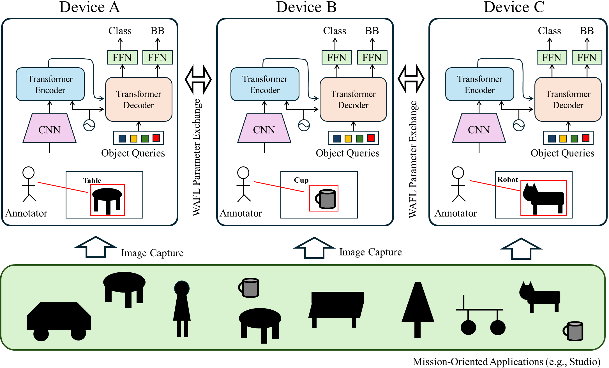

# WAFL-DETR

Wireless Ad Hoc Federated Learning with DEtection TRansformer (WAFL-DETR). This project provides the code for the paper "Tuning Detection Transformer with Device-to-Device Communication for Mission-Oriented Object Detection" (IEEE WiMob CWN workshop, 2024). These codes are edited versions of [the original DETR codes](https://github.com/facebookresearch/detr) to make them compatible with WAFL.

## Architecture



The figure shows the overview of WAFL-DETR. In WAFL-DETR, each user first annotates the data they have, and then their model is trained collaboratively with other users' models using WAFL. Through this collaborative learning, it is aimed to enable detection of objects that you have not annotated yourself.

## Model exchange and aggregation

In this study, we verified three learning and model exchange methods. The first is Full Parameter Exchange (FPE), in which all parameters are learned and exchanged. The second is Transformer Layer Exchange (TLE), in which the CNN weights are fixed and other parameters are learned and exchanged. The third is Head Exchange (HE), in which only the FFN and object query are learned and exchanged.

Also, in this scenario, all the devices are assumed to be fixed and exchange their model with neighboring devices based on topology. We verified three types of topology : line, tree, and ringstar.

## Data preparation

We created the target dataset by selecting 10 categories from the Open Image Dataset and used it. Please download the custom dataset from [here](https://drive.google.com/file/d/1Isfu-4ojrI1xakTK6Aw9TX3zhIK31boT/view) and set it in the `WAFL-DETR` directory. We expect the directory strcture to be the following.
```
WAFL-DETR/data/custom/
  annotations # annotation json files
  train2017 # train images
  val2017 # val images
```

## Usage

### Module installation

This code has been tested and verified to work with Python 3.11.4 and CUDA 11.6. The specific versions of key dependencies used in our test environment are listed in the `requirements.txt` file.

However, please note that you may need to adjust the versions, especially for `torch` and `torchvision`, to match your specific environment and CUDA version.

After ensuring versions of required dependencies, install them by following commands:

```Linux
pip install -r requirements.txt
```

If you encounter any issues, you may need to modify the versions in `requirements.txt` to suit your specific setup. In particular, ensure that the `torch` and `torchvision` versions are compatible with your CUDA installation if you're using GPU acceleration.

### Change directory
We expect you to execute codes in the `src` directory, so please move there like:

```
cd src
```

### Pretrained-model preparation
Please download pretrained DETR model by running `load_pretrained_model.py` like: 

```
python load_pretrained_model.py
```

We use DETR with ResNet-50. For more information about the model, please refer to [here](https://github.com/facebookresearch/detr).

### Training

To train the models, please exectute `main_wafl.py` like:

```
python main_wafl.py \
    --dataset_file "custom" \
    --coco_path "../data/custom/" \
    --output_dir "outputs" \
    --resume "detr-r50_no-class-head.pth" \
    --num_classes 10 \
    --preself_epochs 100 \
    --epochs 200 \
    --batch_size 2 \
    --num_clients 10 \
    --noniid_ratio 90 \
    --lr 1e-5 \
    --lr_backbone 1e-6
```

after training, `outputs` directory is created and it includes `log.txt` and checkpoints. The following explains some config parameters.

#### dataset_file
Please specify "custom" as it uses a custom dataset.

#### coco_path
The path to the dataset directory.

#### output_dir
The path to the directory which includes the results.

#### resume
The path to the file of model parameters. The parameters set here will be used as the initial values when training starts.

#### num_clients
The number of clients which participates in the collaborative learning.

#### noniid_ratio
The percentage of each client's class in the noniid scenario. 

#### topology
Select from `"line"`, `"tree"` and `"ringstar"`. `"line"` is set as the default.

#### iid_setting
Set with boolean `True` and training starts with iid scenario. `False` is set as the default. 

#### tle
Set with boolean `True` and training starts with method TLE. `False` is set as the default. Training starts with method FPE in that case.

#### he
Set with boolean `True` and training starts with method HE. `False` is set as the default. Training starts with method FPE in that case.

### Visualization

after training, `outputs` directory is made. It includes the results of training. If you want to visualize the trends in mAP, you can run `mAP_plot.py` like: 

```
python ./util/mAP_plot.py
```
The trend graphs are made in `outputs` directory.

If you want to check the image with bounding box infered, you can use `box_visualize.py` like:

```
python ./util/box_visualize.py
```

By rewriting the codes at the end of the file, you can set the model for which node, the model for which epoch, which image, and the threshold value for displaying the bounding box.

## References
[1] "Tuning Detection Transformer with Device-to-Device Communication for Mission-Oriented Object Detection" (IEEE WiMob CWN workshop, 2024)
