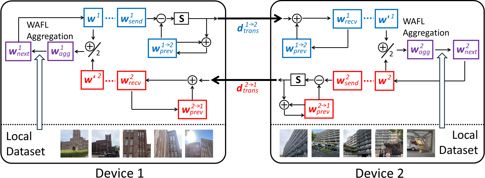

# WAFL-Efficiency

TopK Difference Sparsification (DS) and Difference Quantization (DQ). This project provides the code for the paper "Top-K Difference Sparsification and Quantization for Communication Efficient MOdel Aggregation in Wireless Ad Hoc Federated Learning" (IEEE CAI 2025).

## Methods


This figure illustrates the overview of Top-k Difference Sparsification (DS). When two devices come into contact, they exchange sparsified differences *d<sub>trans</sub>* between their current models *w<sub>send</sub>* and previously transmitted ones *w<sub>prev</sub>*. Afterward, both devices update *w<sub>prev</sub>* by adding *d<sub>trans</sub>* and use the result as the received model *w<sub>recv</sub>*.
Note that when devices exchange their models for the first time, they do not have *w<sub>prev</sub>*, so they exchange the models directly instead of the differences. Alternatively, they initialize *w<sub>prev</sub>* to zero in order to apply Top-k DS. (zero initialization)

Along with DS, we also applied Difference Quantization (DQ), where the sparsified differences are quantized using low bit-widths such as 4 bits or even 1 bit.

## Usage
This code has been tested and verified to work with Python 3.13.3 and CUDA 12.6. The specific versions of key dependencies used in our test environment are listed in the requirements.txt file.

```
pip install -r requirements.txt
```

To train the models, please change the directory and execute main.py as follows:

```
cd src
python3 main.py \
    --pre_epoch 10 \
    --max_epoxh 100 \
    --batch_size 64 \
    --steps_per_epoch 5 \
    --noniid 0.9 \
    --zero_initialization False \
    --reduce "topk_ds_dq" \
    --K 0.1 \
    --Q 1
```

### pre_epoch & max_epoch
epochs for pre-self training and wafl.
### batch_size & steps_per_epoch
The number of samples per mini-batch and the number of mini-batches per epoch.
### noniid
The data is non-independent and identically distributed (non-IID) across devices. Set the non-IID rate between 0 (IID) to 1. For example, when the non-IID rate is set to 0.9, 90% of the data from one class will be concentrated on a single device.
### zero_initialization
The previously transmitted model *w<sub>prev</sub>* is set to zero, and Top-k DS is applied from the first model exchange.
### reduce
Communication reduction method. Set the method to "topk_ds", "topk_ds_dq", or "none"
### K
Sparsification rate for Top-k DS. For example, if this is set to 0.1, only 10% of the original data will be transmitted.
### Q
Quantization bit rate for Top-k DQ.

## Results
You can see training losses and test accuracies in the standard output. After training, the model is saved in the "trained_net" directory.

## Reference
Kaito Tsuchiya, Hiroshi Esaki, Hideya Ochiai. "Top-K Difference Sparsification and Quantization for Communication Efficient Model Aggregation in Wireless Ad Hoc Federated Learning". IEEE Conference on Artificial Intelligence (CAI) 2025.


