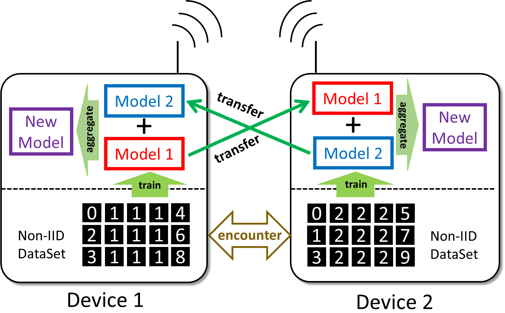
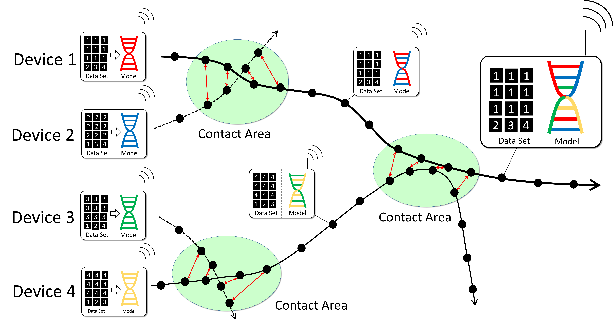
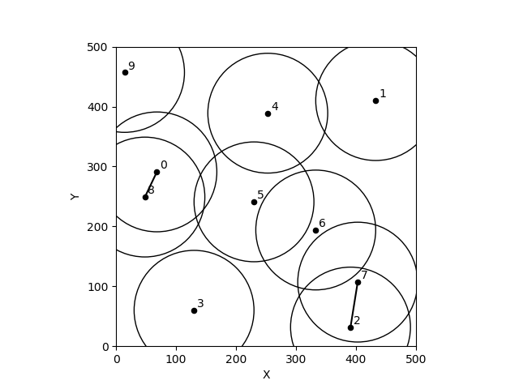
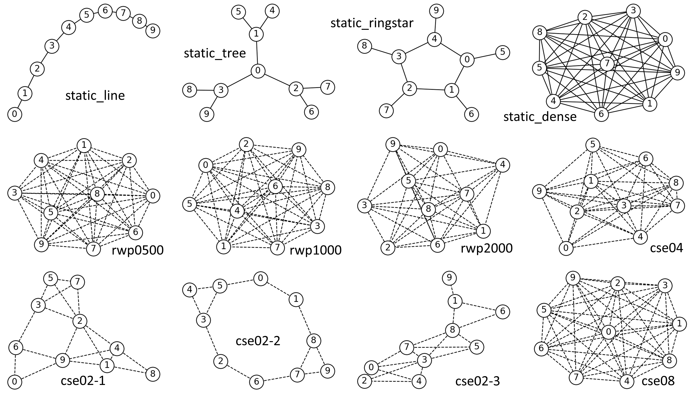
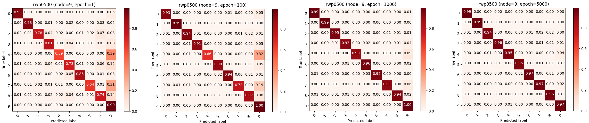

# WAFL-MLP

Wireless Ad Hoc Federated Learning (WAFL). This project provides the code for "Wireless Ad Hoc Federated Learning: A Fully Distributed Cooperative Machine Learning". MLP stands for multi-layer perceptron -- one of the most basic neural networks for beginners.

## 1. Introduction
Privacy-sensitive data is stored in autonomous vehicles, smart devices, or sensor nodes that can move around and can make opportunistic contact with each other. Geographical locations, private photos, healthcare signals, and power consumption of homes are examples. Federation among such nodes was mainly discussed in the context of federated learning (FL) in many works with a centralized parameter server. However, because of multi-vendor issues, they do not want to rely on a specific server operated by a third party for this purpose but want to directly interact with each other in an ad hoc manner only when they have in contact just as cooperative intelligent transport systems do.

Wireless ad hoc federated learning (WAFL) allows collaborative learning with device-to-device communications organized by the devices physically nearby. Here, each node has a wireless interface and can communicate with each other when they are within the radio range. The nodes are expected to move with people, vehicles, or robots, producing opportunistic contacts with each other.

## 2. Architecture


We start the discussion from the most basic peer-to-peer case as shown in the figure. In this scenario, each node trains a model individually with the local data it has. Here, node 1 can be a Toyota car, and node 2 can be a Mitsubishi car. When a node encounters another node, they exchange their local models with each other through the ad hoc communication channel. Then, the node aggregates the models into a new model, which is expected to be more general compared to the locally trained models. With an adjustment process of the new model with the local training data, they repeat this process during they are in contact. Please note that there is no third-party server operated for the federation among multi-vendor devices.

As WAFL does not collect data from users, the distributions of the data on individual nodes are not the same; e.g., a user has a larger portion of photos of hamburgers, but another user has a larger portion of dumplings based on their preferences or circumstances. This is a well-known problem of conventional federated learning as ``user data is not independent and identically distributed (Non-IID)''. The challenge is to develop a general model which does not over-fit into specific user data on the fully distributed, or partially-connected environment. 

## 3. Model Aggregation via Ad Hoc Contacts



Model exchange and aggregation with encountered smart devices in wireless ad hoc federated learning (WAFL). The nodes exchange and aggregate their models among the nodes encountered in an ad hoc manner. The initial models are trained too specific to their local Non-IID data, but in the long run, many contacts allow the mixture of locally trained models, making them more generalized.

## 4. Mobility / Contact Patterns prepared for Simulation

### 4.1. RWP0500



Random Waypoint Mobility (RWP) is often used in wireless ad hoc network simulations. People walk around the given area with posing some duration at temporal locations. This mobility model allows a device to contact with any other devices in the area. This mobility model greatly fits to the movement of people in a shopping mall or in an amusement park. Depending on the size of the people's movable areas, we generated three categories of mobility patterns: i.e., rwp0500, rwp1000, and rwp2000. Here, the name indicates the size of the movable area, for example, rwp0500 was generated by simulating node movements in 500 [m] x 500 [m] square. We assumed 100 [m] for radio range and 10 [epoch] for posing time. We have chosen the travel speed uniformly randomly from the interval of [3.0, 7.0] [m/epoch].

### 4.2. Other Mobility / Contact Patterns


Other mobility/contact patterns prepared for simulation includes static_line, static_tree, static_ringstar, static_dense, and community structured environment (CSE). In static ones, devices do not move and they always have stable contacts with neighbor nodes. CSE is based on the idea that there are several communities in the real society to which people belong, and that they usually meet the people who belong to the same community. CSE assumes that a device belongs to several communities and moves from one community to another. Here, the community is a physical rendezvous point. If two devices are in the same community at the same time, they can communicate with each other.

The figure shows topology examples of device-to-device contacts. The solid lines indicate static connections -- the devicess are always connected and can communicate all the time. The dashed lines indicate opportunistic connections -- the devices will have temporal connections and can communicate while the connections are alive.

Althrough we have prepared these contact patterns, you will see there are no such a difference in learning accuracy. It means WAFL has no critical dependencies in contact patterns or mobility (topology). Thus, in practical experiment, rwp0500 or static_line can be used for understanding the basic characteristics.

## 5. How to Run

### 5.1. Installation of Python Modules

This code has been tested and verified to work with Python 3.11.4 and CUDA 11.4.
The specific versions of key dependencies used in our test environment are listed in the `requirements.txt` file.

However, please note that you may need to adjust the versions, especially for `torch` and `torchvision`, to match your specific environment and CUDA version.

After ensuring versions of required dependencies, install them by following commands:

```Linux
pip install -r requirements.txt
```

If you encounter any issues, you may need to modify the versions in `requirements.txt` to suit your specific setup. In particular, ensure that the `torch` and `torchvision` versions are compatible with your CUDA installation if you're using GPU acceleration.

### 5.2. Execution of Model Training

Please go to src directory and find 'main.py'. By default, the main.py executes WAFL training upto 5000 epochs over rwp0500 contact pattern, and save the experiment case as rwp0500. You can modify these configurations at

```Linux
experiment_case="rwp0500"
cp_filename=f'../data/contact_pattern/rwp_n10_a0500_r100_p10_s01.json'
max_epoch=5000
```

If you change rwp0500 to rwp1000, please modify these parameters as
```Linux
experiment_case="rwp1000"
cp_filename=f'../data/contact_pattern/rwp_n10_a1000_r100_p10_s01.json'
```

The other major contact patterns are listed in the main.py. You can find the available contact patterns in the directory "contact_pattern".

After setting up the configuration, please execute by 

```Linux
cd src
python3 main.py
```

Then, it will give the following messages.

```Linux
using device cuda:0
Pre-self training: [0, 1,   100] loss: 0.38216
Pre-self training: [1, 1,   100] loss: 0.45505
Pre-self training: [1, 1,   200] loss: 0.17502
Pre-self training: [2, 1,   100] loss: 0.54695
Pre-self training: [3, 1,   100] loss: 0.49622
Pre-self training: [4, 1,   100] loss: 0.53549
Pre-self training: [5, 1,   100] loss: 0.60977
Pre-self training: [6, 1,   100] loss: 0.46071
Pre-self training: [7, 1,   100] loss: 0.51975
Pre-self training: [8, 1,   100] loss: 0.50974
Pre-self training: [9, 1,   100] loss: 0.50542
Pre-self training: [0, 2,   100] loss: 0.11843
Pre-self training: [1, 2,   100] loss: 0.10288
```

After the pre-self training, WAFL training begins with simulating the communication links among the nodes. The trained models at each epoch at each device will be saved into "trained_net" directory sperated by "experiment_case" given above: e.g., trained_net/rwp0500.

### 5.3. Drawing Confusion Matrics

You can generate confusion matrics at specified devices and epochs by executing "draw_confusion_matrix.py" using the trained models saved. Before executing, please set the configuration. The default parameter values are:

```Linux
experiment_case = 'rwp0500'     # the name of the experiment case
epochs = [1, 100, 1000, 5000]   # specify the epochs in a list like epochs = [1, 10, 100, 1000, 5000]
nodes = [9]                     # specify the devices in a list like nodes = [0, 1, 2]
```

Please note that this configuration expects model training has been finished upto 5000 epochs under the name rwp0500. Then, you can run

```Linux
python3 draw_confusion_matrix.py
```

This gives four confusion matrics at device 9 at epochs 1, 100, 1000, 5000 as follows.



### 5.4. Drawing Accuracy Trends

You can generate accuracy trend graphs by executing "draw_accuracy_trend.py" using the trained models saved. Before executing, please set the configuration. The default parameter values are:

```Linux
output_code="rwp"         # name of the file
exp_codes=['rwp0500','rwp1000','rwp2000']     # multiple experiment_cases can be listed

max_epoch=5000     # default 5000
n_device=10        # fixed to 10
```

Please note that this configuration expects model training has been finished upto 5000 epochs under the names rwp0500, rwp1000, and rwp2000. Then, you can run,

```Linux
python3 draw_accuracy_trend.py
```

This gives the tree accuracy trends in a comparable form as follows.


## References 
\[1\] Hideya Ochiai, Yuwei Sun, Qingzhe Jin, Nattanon Wongwiwatchai, Hiroshi Esaki, "Wireless Ad Hoc Federated Learning: A Fully Distributed Cooperative Machine Learning" in May 2022 (https://arxiv.org/abs/2205.11779). 
