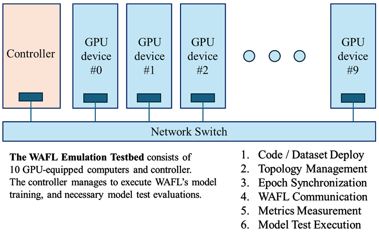

# WAFL Emulation Testbed

The WAFL Emulation Testbed project, launched in April 2025, is trying to develop a research platform for WAFL's device-to-device collaborative learning over real TCP/IP-based communications. The previous researches were mainly conducted by "simulation", which executes "model exchange" on the memory space in a single computer. This emulation platform has 10 devices (assuming 10 GPU-equipped computers) and one control server connected in a local area network. Even though these devices can always be connected over the Ethernet, device-to-device contact patterns can be defined and controlled to ensure the reproducibility of the experiments.



## Setup

### Prerequisites

- Python 3.11.4 (auto-installed via mise)
- SSH access to all servers (passwordless public key authentication)
- `~/.ssh/id_ed25519` private key

### 1. Install mise

[mise](https://mise.jdx.dev/) manages runtime versions and tasks.

```bash
# Install mise
curl https://mise.run | sh

# Activate mise in your shell
echo 'eval "$(~/.local/bin/mise activate bash)"' >> ~/.bashrc  # for bash
source ~/.bashrc

# Verify installation
mise --version
```

### 2. Configure Environment Variables

Create `.env` file for deployment settings:

```bash
cp .env.sample .env
```

Edit `.env`:

```bash
DEPLOY_CTRL_SERVER_USER=your_username
DEPLOY_CTRL_SERVER_HOST=your_ctrl_server_hostname
DEPLOY_CTRL_SERVER_DIST=/path/to/deployment/directory
```

Create `execution_config` file for execution settings:

```bash
cp execution_config_sample execution_config
```

Edit `ctrl/execution_config`:

```bash
export CTRL_SERVER_IP='192.168.11.10'
export WAFL_DEVICE_NAMES='100,101,102,103,104,105,106,107,108,109'
export WAFL_DEVICE_IPS='192.168.11.100,192.168.11.101,...'
export WAFL_DEVICE_CTRL_PORT=10001
export WAFL_DEVICE_P2P_PORT=10002
export USER='your_username'
export DEPLOYMENT_LOCATION='/path/to/workspace'
export EXPERIMENT_NAME='your_experiment_name'
```

**Note:** Ensure `WAFL_DEVICE_NAMES` and `WAFL_DEVICE_IPS` have matching element counts.

### 3. Install Dependencies

```bash
mise setup
```

This installs Python, uv, creates `.venv`, installs dependencies, and sets up pre-commit hooks.

### 4. VS Code Setup (Optional)

Install recommended extensions:
- [Ruff](https://marketplace.visualstudio.com/items?itemName=charliermarsh.ruff)
- [Python](https://marketplace.visualstudio.com/items?itemName=ms-python.python)

Select interpreter: `Ctrl+Shift+P` → "Python: Select Interpreter" → `.venv/bin/python`

## Directory Structure

```
WAFL-Testbed/
├── mise.toml                   # mise configuration
├── pyproject.toml              # Python project config
├── .env                        # Environment variables (not in git)
├── .env.sample                 # Environment variables template
├── ctrl/                       # Control server scripts
│   ├── main.py                 # Main control script
│   ├── deploy.sh               # Deployment script
│   ├── collect.py              # Result collection
│   ├── analyze.py              # Result analysis
│   ├── generate_datasets.py    # Dataset splitting
│   ├── parameters.json         # Experiment parameters
│   ├── execution_config        # Experiment execution config (not in git)
│   └── contact_pattern/
├── wafl/                       # Execution server code
│   ├── dataset/
│   │   ├── common/             # Common data for all devices
│   │   └── 0/, 1/, .../        # Device-specific data
│   ├── config/
│   │   ├── common/
│   │   └── 0/, 1/, .../
│   └── src/
│       ├── common/
│       │   ├── main.py
│       │   └── net.py
│       └── 0/, 1/, .../
├── data/                       # Local data storage
└── results/                    # Experiment results
```

**Note:** `wafl/` uses `common/` for shared files and `[device_name]/` for device-specific files. During deployment, `common/` files are deployed to all devices, then device-specific files override as needed.

## Usage

### Generate Datasets

```bash
source .venv/bin/activate
cd ctrl
python generate_datasets.py
```

### Run Experiment

Edit `ctrl/parameters.json`:

```json
{
  "epochs": {"self": 64, "wafl": 5120},
  "contact_pattern": "rwp_n10_a0500_r100_p10_s01.json",
  "wafl_phase_params": {"aggregation_strategy": "FedAvg"}
}
```

Start experiment:

```bash
mise start
```

Monitor via screen session:

```bash
ssh ${DEPLOY_CTRL_SERVER_USER}@${DEPLOY_CTRL_SERVER_HOST}
screen -r wafl
```

### Collect and Analyze Results

```bash
mise analyze
```

Results are saved to `results/[experiment_id]`.

## Development

### Available mise Tasks

- `mise setup` - Install Python, uv, dependencies, and pre-commit hooks
- `mise lint` - Run ruff linter with auto-fix
- `mise deploy` - Deploy to control and execution servers
- `mise start` - Start experiment
- `mise analyze` - Collect and analyze results

### Add Packages

```bash
source .venv/bin/activate
uv add <package-name>
```

### CI/CD

GitHub Actions runs checks on pushes to:
- `testbed-develop`
- `testbed-develop-ctrl`
- `testbed-develop-wafl`
