# 結果分析ガイド / Results Analysis Guide

**日本語** | [English](#english-version)

---

## 日本語版

WAFL-Testbed は `ctrl/analyze.py` を通じて包括的な結果分析とグラフ生成機能を提供する．本ドキュメントでは分析ワークフロー，生成される成果物，およびメトリクスの解釈方法について解説する．

---

### 1. 分析ワークフロー

#### 1.1 基本的な実行方法

```bash
# 推奨: mise タスク経由で実行
mise analyze
```

このコマンドは以下を順次実行する：
1. 全ノードから結果を収集（SSH 経由）
2. ローカルに rsync でダウンロード
3. グラフ生成と分析レポート作成

#### 1.2 analyze.py のオプション

```bash
# 結果収集のみ（管理サーバー上で実行）
python ctrl/analyze.py --collect

# グラフ生成のみ（ローカルで実行）
python ctrl/analyze.py --generate

# 特定の実験 ID を指定
python ctrl/analyze.py --experiment wafl-experiment-20260115T140000

# 比較レポート生成
python ctrl/analyze.py --compare
```

---

### 2. ディレクトリ構造

分析完了後，以下の構造で結果が保存される：

```
results/
└── wafl-experiment-20260115T140000/
    ├── summary/                    # コントロールサーバーのログ
    │   ├── ctrl_output.log         # コントロールサーバーの標準出力
    │   └── metadata.jsonl          # エポック時間などのメタデータ
    ├── collected/                  # 各ノードから収集したデータ
    │   ├── 0/
    │   │   ├── metrics_0.jsonl     # 構造化メトリクス
    │   │   ├── resources_0.csv     # システムリソース使用量
    │   │   ├── output.log          # ノードの標準出力
    │   │   └── model_instance.pth  # 最終モデル
    │   ├── 1/
    │   │   └── ...
    │   └── 2/
    │       └── ...
    └── analysis/                   # 生成された分析結果
        ├── graphs/                 # グラフ画像
        │   ├── test_accuracy.png
        │   ├── epoch_duration.png
        │   ├── survival_rate.png
        │   └── ...
        ├── report.md               # 分析レポート
        └── metrics.csv             # 統合メトリクス CSV
```

---

### 3. 生成されるグラフ

#### 3.1 グラフ一覧

| グラフ名               | ファイル名               | 説明                 | フェーズ  |
| ---------------------- | ------------------------ | -------------------- | --------- |
| **Test Accuracy**      | `test_accuracy.png`      | テスト精度の推移     | SELF+WAFL |
| **Epoch Duration**     | `epoch_duration.png`     | エポック所要時間     | SELF+WAFL |
| **Idle Time Ratio**    | `idle_time_ratio.png`    | アイドル時間比率     | WAFL      |
| **Wasted Computation** | `wasted_computation.png` | SSP による破棄計算量 | WAFL      |
| **Survival Rate**      | `survival_rate.png`      | モデル生存率         | WAFL      |
| **Goodput**            | `goodput.png`            | 有効スループット     | WAFL      |
| **Traffic Volume**     | `traffic_volume.png`     | トラフィック量       | WAFL      |
| **Asymmetry**          | `asymmetry.png`          | モデル受信分布       | WAFL      |
| **Survivor Quality**   | `survivor_quality.png`   | 生存者品質分析       | WAFL      |
| **Network Quality**    | `network_quality.png`    | ネットワーク品質分布 | WAFL      |

#### 3.2 Test Accuracy

**説明**: 各ノードのテスト精度をエポックごとにプロット．

**解釈**:
- 各線は個別ノードを表す
- 太線は全ノードの平均値
- SELF → WAFL フェーズ境界に垂直線
- 理想的には全ノードが収束し，高精度に到達

**例**:

```mermaid
xychart-beta
    title "Test Accuracy"
    x-axis "Epoch" [0, 64, 500, 1000, 2000, 4096]
    y-axis "Accuracy (%)" 0 --> 100
    line "Mean" [20, 45, 70, 82, 90, 92]
```

> `|│` SELF → WAFL フェーズ境界は垂直線で示される

#### 3.3 Epoch Duration

**説明**: 各エポックの Wall-clock time（実時間）をプロット．

**成分**:
- **Learning Time**: ローカル学習時間
- **Communication Time**: モデル交換時間
- **Waiting Time**: 同期待機時間

**解釈**:
- SELF フェーズ: 通信なし，学習時間のみ
- WAFL フェーズ: 通信＋待機時間が加算
- SSP が効果的な場合，待機時間が削減される

**例**:



```mermaid
xychart-beta
    title "Epoch Duration"
    x-axis "Phase" [SELF, WAFL]
    y-axis "Duration (s)" 0 --> 30
    bar "Learning" [5, 10]
    bar "Communication" [0, 12]
    bar "Waiting" [0, 3]
```

> WAFL フェーズでは通信＋待機時間が加算される

#### 3.4 Survival Rate

**説明**: UDP/FEC モードでのモデル生存率をプロット．

**定義**:
$$\text{Survival Rate} = \frac{\text{成功した転送数}}{\text{試行した転送数}}$$

**解釈**:
- 100% = 全転送成功
- 低下 = パケットロスにより FEC 復元失敗
- Dynamic モードでは FEC 冗長度調整により改善が期待される

#### 3.5 Goodput

**説明**: 有効スループット（アプリケーション層で利用可能なデータ転送速度）をプロット．

**定義**:
$$\text{Goodput} = \frac{\text{有効データ量 (bytes)}}{\text{転送時間 (s)}}$$

**コンポーネント**:
- **Sent Goodput**: 送信側のスループット
- **Received Goodput**: 受信側のスループット

**解釈**:
- 高い Goodput = 効率的な通信
- Sent > Received = パケットロスや FEC 失敗
- 帯域制限に近い値 = 帯域飽和

#### 3.6 Wasted Computation

**説明**: SSP によって破棄された計算量をプロット．

**メトリクス**:
- **wasted_ms**: 破棄された学習時間（ミリ秒）
- **wasted_norm**: 学習したが反映されなかったモデル差分のノルム
- **batches_processed**: 破棄された学習で処理したバッチ数

**解釈**:
- 高い wasted = 計算リソースの無駄
- SSP 閾値が低いほど wasted が増加
- トレードオフ: 速度 vs 計算効率

#### 3.7 Traffic Volume

**説明**: ネットワークトラフィック量をプロット（送信・受信・累積）．

**メトリクス**:
- **TX (Transmit)**: 送信バイト数
- **RX (Receive)**: 受信バイト数
- **Cumulative**: 累積トラフィック

**解釈**:
- Dynamic/Fast モードでは FEC オーバーヘッドが加算
- 圧縮が有効な場合はトラフィック削減

#### 3.8 Asymmetry

**説明**: 各ノードが受信したモデル数の分布をプロット．

**解釈**:
- 均等 = バランスの取れた P2P 通信
- 偏り = 特定ノードへの負荷集中
- 0 受信 = 孤立ノード（接触パターンに依存）

#### 3.9 Network Quality

**説明**: ネットワーク品質ランクの分布をプロット．

**品質ランク**:
| ランク    | 帯域    | 遅延  | 損失率 |
| --------- | ------- | ----- | ------ |
| Excellent | 100mbit | 5ms   | 0%     |
| Good      | 20mbit  | 20ms  | 1%     |
| Fair      | 5mbit   | 50ms  | 5%     |
| Poor      | 1mbit   | 100ms | 10%    |

---

### 4. 分析レポート (report.md)

分析完了後に生成される Markdown レポートの構成：

```markdown
# Experiment Report: wafl-experiment-20260115T140000

## Summary
- **Total Duration**: 3h 24m 15s
- **SELF Epochs**: 64
- **WAFL Epochs**: 4096
- **Nodes**: 50

## Performance Metrics

### Learning Quality
| Metric               | Mean  | Min   | Max   | Std   |
| -------------------- | ----- | ----- | ----- | ----- |
| Final Test Accuracy  | 0.923 | 0.912 | 0.934 | 0.006 |
| Final Train Accuracy | 0.956 | 0.948 | 0.967 | 0.005 |

### Communication Efficiency
| Metric             | Value    |
| ------------------ | -------- |
| Mean Survival Rate | 0.978    |
| Mean Goodput (TX)  | 8.5 Mbps |
| Mean Goodput (RX)  | 7.2 Mbps |
| Total Traffic      | 1.2 GB   |

### SSP Metrics
| Metric            | Value     |
| ----------------- | --------- |
| Force-Skip Events | 342       |
| Total Wasted Time | 12,456 ms |
| Wasted Percentage | 2.3%      |

## Graphs

[Test Accuracy](graphs/test_accuracy.png)
[Epoch Duration](graphs/epoch_duration.png)
...
```

---

### 5. 比較分析

#### 5.1 比較レポート生成

```bash
# 全実験を比較
python ctrl/analyze.py --compare

# 特定のネットワーク条件で比較
python ctrl/analyze.py --compare --condition excellent
```

#### 5.2 比較グラフ

| グラフ名                    | 説明                     |
| --------------------------- | ------------------------ |
| `comparison_accuracy.png`   | 各手法の最終精度比較     |
| `comparison_epoch_time.png` | 各手法のエポック時間比較 |
| `comparison_survival.png`   | 各手法の生存率比較       |
| `comparison_goodput.png`    | 各手法の Goodput 比較    |
| `comparison_efficiency.png` | 総合効率比較             |

#### 5.3 比較レポート (comparison_report.md)

```markdown
# Comparison Report: Experiment 0 (excellent)

## Experiment Overview
| Experiment                 | Method  | Network   | Nodes | WAFL Epochs |
| -------------------------- | ------- | --------- | ----- | ----------- |
| exp0_1-excellent-1-tcp     | TCP     | Excellent | 50    | 64          |
| exp0_1-excellent-3-dynamic | Dynamic | Excellent | 50    | 64          |
| exp0_1-excellent-4-fast    | Fast    | Excellent | 50    | 64          |

## Performance Comparison

### Final Accuracy
| Method  | Mean ± Std    | Min   | Max   |
| ------- | ------------- | ----- | ----- |
| TCP     | 0.923 ± 0.006 | 0.912 | 0.934 |
| Dynamic | 0.921 ± 0.007 | 0.908 | 0.931 |
| Fast    | 0.919 ± 0.008 | 0.905 | 0.929 |

### Epoch Duration (WAFL Phase Mean)
| Method  | Duration (s) | Speedup vs TCP |
| ------- | ------------ | -------------- |
| TCP     | 15.2         | 1.00x          |
| Dynamic | 12.8         | 1.19x          |
| Fast    | 10.5         | 1.45x          |

### Survival Rate
| Method  | Mean  | Min   |
| ------- | ----- | ----- |
| TCP     | 1.000 | 1.000 |
| Dynamic | 0.985 | 0.923 |
| Fast    | 0.978 | 0.912 |
```

---

### 6. メトリクス定義

#### 6.1 効率性メトリクス

| メトリクス         | 定義                           | 単位   |
| ------------------ | ------------------------------ | ------ |
| **epoch_duration** | エポック開始から終了までの時間 | 秒     |
| **learning_time**  | ローカル学習に費やした時間     | 秒     |
| **comm_time**      | モデル交換に費やした時間       | 秒     |
| **wait_time**      | 同期待機に費やした時間         | 秒     |
| **wasted_ms**      | SSP により破棄された学習時間   | ミリ秒 |
| **wasted_norm**    | 破棄されたモデル差分のノルム   | -      |

#### 6.2 ネットワークメトリクス

| メトリクス               | 定義                 | 単位     |
| ------------------------ | -------------------- | -------- |
| **survival_rate**        | 成功転送 / 試行転送  | 0.0〜1.0 |
| **goodput_tx**           | 送信有効スループット | Mbps     |
| **goodput_rx**           | 受信有効スループット | Mbps     |
| **traffic_tx**           | 送信トラフィック量   | bytes    |
| **traffic_rx**           | 受信トラフィック量   | bytes    |
| **fec_recovery_success** | FEC 復元成功回数     | 回       |
| **fec_recovery_fail**    | FEC 復元失敗回数     | 回       |

#### 6.3 学習メトリクス

| メトリクス            | 定義         | 単位     |
| --------------------- | ------------ | -------- |
| **train_acc**         | 訓練精度     | 0.0〜1.0 |
| **train_loss**        | 訓練損失     | -        |
| **test_acc**          | テスト精度   | 0.0〜1.0 |
| **test_loss**         | テスト損失   | -        |
| **models_received**   | 受信モデル数 | 個       |
| **models_aggregated** | 集約モデル数 | 個       |

#### 6.4 圧縮メトリクス

| メトリクス             | 定義         | 単位          |
| ---------------------- | ------------ | ------------- |
| **compression_method** | 使用圧縮方式 | none/lz4/zlib |
| **compression_ratio**  | 圧縮率       | 0.0〜1.0      |
| **compression_time**   | 圧縮時間     | 秒            |

---

### 7. WandB 統合

実験メトリクスは WandB にも記録可能：

```bash
# 環境変数で API キーを設定
export WANDB_API_KEY=your_api_key

# parameters.json で有効化
{
  "wandb": {
    "enabled": true,
    "project": "WAFL-Testbed"
  }
}
```

---

## English Version

### Overview

WAFL-Testbed provides comprehensive results analysis and graph generation through `ctrl/analyze.py`.

### Workflow

```bash
# Recommended: via mise task
mise analyze
```

### Generated Graphs

| Graph              | Description                  |
| ------------------ | ---------------------------- |
| Test Accuracy      | Test accuracy over epochs    |
| Epoch Duration     | Wall-clock time per epoch    |
| Survival Rate      | Model transfer success rate  |
| Goodput            | Effective throughput         |
| Traffic Volume     | Network traffic              |
| Wasted Computation | SSP discarded computation    |
| Asymmetry          | Received models distribution |

### Key Metrics

- **Efficiency**: epoch_duration, wasted_ms
- **Network**: survival_rate, goodput, traffic
- **Learning**: train_acc, test_acc, models_received
- **Compression**: compression_ratio, compression_time

### Comparison Analysis

```bash
python ctrl/analyze.py --compare
```

Generates comparison graphs and reports across different experiments and methods.
