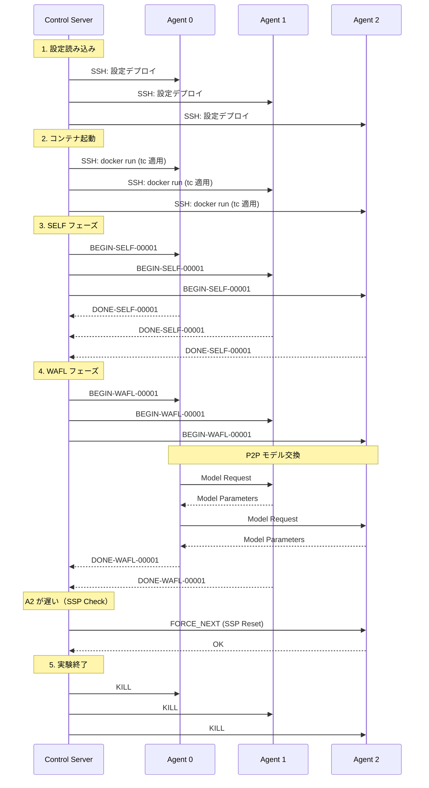

# システムアーキテクチャ / System Architecture

**日本語** | [English](#english-version)

---

## 日本語版

### 概要

WAFL-Testbed は，Device-to-Device (D2D) 連合学習を実 TCP/IP ネットワーク上でエミュレートするための研究プラットフォームである．シミュレーションでは再現困難な**実環境制約**（OS レイヤ遅延，物理リソース競合，ネットワークスタック挙動）を定量化できる．

### システムコンポーネント

#### 1. コントロールサーバー (Control Server)

**役割**: 実験のオーケストレーター

**責務**:
- 全エージェントへの設定・コードデプロイ
- 実験ライフサイクル管理（開始，停止，クリーンアップ）
- ログ・結果の収集
- 学習プロセスの同期制御（SSP, Strict Sync 等）

**実装**: `ctrl/main.py`

**主要クラス**:
- `ControlServer`: 実験全体の制御
- `WaflAgent`: 各エージェントとの通信インターフェース

**動作フロー**:
1. `execution_config.json` と `parameters.json` を読み込み
2. 全エージェントに SSH 経由で設定をデプロイ
3. Docker コンテナを起動（リソース制限適用）
4. ネットワークエミュレーション (tc/netem) を適用
5. SELF フェーズ → WAFL フェーズの順に実行を指示
6. エポックごとに同期制御（SSP 閾値チェック，FORCE_NEXT 発行）
7. 実験終了後，全エージェントを正常終了

#### 2. 実行サーバー (Execution Servers / Agents)

**役割**: 実際のモデル学習を実行するワーカーノード

**責務**:
- ローカル学習（SELF フェーズ）
- モデルパラメータ交換（WAFL フェーズ）
- リソース使用量のモニタリング
- 構造化ログの出力（JSON Lines）

**実装**: `wafl/src/common/main.py`

**主要クラス**:
- `CTRL_TCP`: コントロールサーバーとの通信
- `ModelLearningUtils`: 学習ロジック (SELF/WAFL)
- `ModelSharingUtils`: P2P モデル交換 (TCP/UDP)
- `MetricsLogger`: JSON Lines 形式のログ出力

**デプロイ方式**: Docker コンテナとして起動（環境の一貫性と分離を保証）

### 通信フロー

#### 1. 制御通信 (Control Communication)

```
┌─────────────────┐         TCP (Port 10001)         ┌──────────┐
│ Control Server  │ ───────────────────────────────> │  Agent   │
│                 │                                  │          │
│  ControlServer  │ <─────────────────────────────── │ CTRL_TCP │
└─────────────────┘         Status / Logs            └──────────┘
```

**プロトコル**: TCP  
**デフォルトポート**: 10001（コンテナ内），設定可能（ホスト側）

**コマンド (Control Server → Agent)**:
| コマンド             | 形式               | 説明                                |
| -------------------- | ------------------ | ----------------------------------- |
| `BEGIN-SELF-{epoch}` | `BEGIN-SELF-00001` | SELF 学習開始                       |
| `BEGIN-WAFL-{epoch}` | `BEGIN-WAFL-00100` | WAFL 学習開始                       |
| `STAT`               | `STAT`             | ステータス要求                      |
| `FORCE_NEXT`         | `FORCE_NEXT`       | SSP Reset: 現在のエポックを強制終了 |
| `KILL`               | `KILL`             | プロセス正常終了                    |

**レスポンス (Agent → Control Server)**:
| ステータス             | 形式              | 説明       |
| ---------------------- | ----------------- | ---------- |
| `READY`                | `READY`           | 待機中     |
| `EXEC-{phase}-{epoch}` | `EXEC-WAFL-00100` | 実行中     |
| `DONE-{phase}-{epoch}` | `DONE-WAFL-00100` | 完了       |
| `ERROR`                | `ERROR`           | エラー発生 |

#### 2. P2P データ共有 (Model Exchange)

```
┌─────────┐     Model Request     ┌─────────┐
│ Agent A │ <───────────────────> │ Agent B │
│         │                       │         │
│         │ <──────────────────── │         │
└─────────┘   Model Parameters    └─────────┘
```

**プロトコル**: TCP または UDP（設定可能）  
**デフォルトポート**: 10002

**TCP モード（デフォルト）**:
- **利点**: 信頼性の高い転送，パケット順序保証
- **欠点**: 再送による遅延，HOL Blocking
- **用途**: 安定したネットワーク環境

**UDP + FEC モード**:
- **利点**: 再送遅延なし，高速転送
- **欠点**: パケットロス時の復元失敗リスク
- **FEC アルゴリズム**: Block-based XOR（zfec ライブラリ使用）
  - パラメータ `fec_m`: M 個のデータチャンクに 1 個の冗長パケット
  - 冗長率: $1/(M+1)$
  - 復元条件: 1 ブロック内で最大 1 パケットロスまで復元可能
- **用途**: 高損失・低遅延が求められる環境

**圧縮 (Compression)**:
- **方式**: None, LZ4 (高速), zlib (高圧縮)
- **選択**: 動的選択 (Adaptive Compression)
  - 推定転送時間 $T_{est} = T_{comp} + \frac{Size_{comp} \times R}{BW}$ を最小化
  - $R$: FEC 冗長率 = $1 + 1/(M+1)$
  - $BW$: EMA で推定された帯域

### ネットワークエミュレーション

実環境を模擬するため，Linux の TC ツール (`tc`, `netem`) を使用してネットワーク条件を制御する．

#### 実装方式

```bash
# コンテナの仮想イーサネット (veth) に tc ルールを適用
tc qdisc add dev veth0 root netem \
  delay 50ms \          # 遅延
  loss 3% \             # パケットロス率
  rate 10mbit           # 帯域制限
```

#### 制御可能なパラメータ

| パラメータ | 説明                           | 設定例                  |
| ---------- | ------------------------------ | ----------------------- |
| **delay**  | ネットワーク遅延（レイテンシ） | `"50ms"`, `"100ms"`     |
| **loss**   | ランダムパケットドロップ率     | `"0%"`, `"3%"`, `"10%"` |
| **rate**   | 最大転送レート（帯域制限）     | `"100mbit"`, `"10mbit"` |

#### 設定方法

**グローバル設定**（全ノード共通）:
`ctrl/parameters.json` の `network_condition` セクション

**ノード個別設定**:
`ctrl/execution_config.json` の各ノードに `network_condition` を追加（優先度高）

### リソース制限

Docker の `--cpus` オプションで CPU 使用率を制限し，異なる性能のデバイスを模擬する．

**設定例**:
```json
{
  "id": 0,
  "cpu_limit": "1.0"  // 1 コア分
}
```

| cpu_limit | 意味                |
| --------- | ------------------- |
| `"1.0"`   | 1 CPU コア（100%）  |
| `"0.5"`   | 0.5 CPU コア（50%） |
| `"2.0"`   | 2 CPU コア（200%）  |

### ソフトウェアスタック

| カテゴリ           | 使用技術     |
| ------------------ | ------------ |
| **言語**           | Python 3.11+ |
| **深層学習**       | PyTorch      |
| **コンテナ化**     | Docker       |
| **パッケージ管理** | uv           |
| **タスクランナー** | mise         |
| **SSH 自動化**     | Paramiko     |
| **FEC**            | zfec         |
| **圧縮**           | zlib, lz4    |

### データフロー



### SSP (Semi-Synchronous Protocol) 実装

#### 動作原理

1. **完了率チェック**: 完了ノード数が `len(agents) × ssp_threshold` に達したか確認
2. **強制進行**: 閾値達成時，未完了ノードに `FORCE_NEXT` コマンドを送信
3. **計算破棄**: 未完了ノードは現在の学習を中断し，次エポックへ進む
4. **メトリクス記録**: 破棄された計算量（`wasted_ms`, `wasted_norm`）を記録

#### コード例 (ctrl/main.py)

```python
if ssp_threshold < 1.0:
    # 完了ノード数をカウント
    completed_count = sum(1 for ae in agent_epochs.values() if ae >= target_epoch)
    
    if completed_count >= len(self.agents) * ssp_threshold:
        # 未完了ノードに強制進行
        for agent in self.agents:
            if agent_epochs[agent.name] < target_epoch:
                agent._send_command("FORCE_NEXT\r\n")
                agent_epochs[agent.name] = target_epoch
```

---

## English Version

### Overview

WAFL-Testbed is a research platform for emulating Device-to-Device (D2D) Federated Learning over real TCP/IP networks. It quantifies **real-world constraints** difficult to reproduce in simulations: OS-layer latency, physical resource contention, and network stack behavior.

### System Components

#### 1. Control Server

**Role**: Experiment Orchestrator

**Responsibilities**:
- Deploy configuration and code to all agents
- Manage experiment lifecycle (Start, Stop, Cleanup)
- Collect logs and results
- Control learning process synchronization (SSP, Strict Sync, etc.)

**Implementation**: [`ctrl/main.py`](file:///home/ktakahashi/workspace/wafl/WAFL-Testbed/ctrl/main.py)

**Main Classes**:
- `ControlServer`: Overall experiment control
- `WaflAgent`: Communication interface with each agent

**Operation Flow**:
1. Load `execution_config.json` and `parameters.json`
2. Deploy configurations to all agents via SSH
3. Launch Docker containers (apply resource limits)
4. Apply network emulation (tc/netem)
5. Direct execution: SELF phase → WAFL phase
6. Per-epoch synchronization control (SSP threshold check, FORCE_NEXT issuance)
7. Graceful shutdown of all agents after experiment completion

#### 2. Execution Servers (Agents)

**Role**: Worker nodes executing actual model training

**Responsibilities**:
- Local training (SELF phase)
- Model parameter exchange (WAFL phase)
- Resource usage monitoring
- Structured logging output (JSON Lines)

**Implementation**: [`wafl/src/common/main.py`](file:///home/ktakahashi/workspace/wafl/WAFL-Testbed/wafl/src/common/main.py)

**Main Classes**:
- `CTRL_TCP`: Communication with Control Server
- `ModelLearningUtils`: Learning logic (SELF/WAFL)
- `ModelSharingUtils`: P2P model exchange (TCP/UDP)
- `MetricsLogger`: JSON Lines format log output

**Deployment**: Launched as Docker containers (ensuring environment consistency and isolation)

### Communication Flow

#### 1. Control Communication

```
┌─────────────────┐         TCP (Port 10001)         ┌──────────┐
│ Control Server  │ ───────────────────────────────> │  Agent   │
│                 │                                  │          │
│  ControlServer  │ <─────────────────────────────── │ CTRL_TCP │
└─────────────────┘         Status / Logs            └──────────┘
```

**Protocol**: TCP  
**Default Port**: 10001 (inside container), configurable (host side)

**Commands (Control Server → Agent)**:
| Command              | Format             | Description                              |
| -------------------- | ------------------ | ---------------------------------------- |
| `BEGIN-SELF-{epoch}` | `BEGIN-SELF-00001` | Start SELF learning                      |
| `BEGIN-WAFL-{epoch}` | `BEGIN-WAFL-00100` | Start WAFL learning                      |
| `STAT`               | `STAT`             | Status request                           |
| `FORCE_NEXT`         | `FORCE_NEXT`       | SSP Reset: force terminate current epoch |
| `KILL`               | `KILL`             | Graceful process termination             |

**Responses (Agent → Control Server)**:
| Status                 | Format            | Description    |
| ---------------------- | ----------------- | -------------- |
| `READY`                | `READY`           | Waiting        |
| `EXEC-{phase}-{epoch}` | `EXEC-WAFL-00100` | Executing      |
| `DONE-{phase}-{epoch}` | `DONE-WAFL-00100` | Completed      |
| `ERROR`                | `ERROR`           | Error occurred |

#### 2. P2P Data Sharing (Model Exchange)

```
┌─────────┐     Model Request    ┌─────────┐
│ Agent A │ ───────────────────> │ Agent B │
│         │                      │         │
│         │ <─────────────────── │         │
└─────────┘   Model Parameters   └─────────┘
```

**Protocol**: TCP or UDP (configurable)  
**Default Port**: 10002

**TCP Mode (Default)**:
- **Advantages**: Reliable transfer, packet order guarantee
- **Disadvantages**: Retransmission delays, HOL Blocking
- **Use Case**: Stable network environments

**UDP + FEC Mode**:
- **Advantages**: No retransmission delays, fast transfer
- **Disadvantages**: Recovery failure risk on packet loss
- **FEC Algorithm**: Block-based XOR (using zfec library)
  - Parameter `fec_m`: 1 redundant packet per M data chunks
  - Redundancy rate: $1/(M+1)$
  - Recovery condition: Recoverable up to 1 packet loss per block
- **Use Case**: High-loss, low-latency environments

**Compression**:
- **Methods**: None, LZ4 (fast), zlib (high compression)
- **Selection**: Adaptive Compression
  - Minimize estimated transfer time: $T_{est} = T_{comp} + \frac{Size_{comp} \times R}{BW}$
  - $R$: FEC redundancy rate = $1 + 1/(M+1)$
  - $BW$: Bandwidth estimated by EMA

### Network Emulation

Uses Linux TC tools (`tc`, `netem`) to control network conditions for simulating real environments.

#### Implementation Method

```bash
# Apply tc rules to container's virtual ethernet (veth)
tc qdisc add dev veth0 root netem \
  delay 50ms \          # Latency
  loss 3% \             # Packet loss rate
  rate 10mbit           # Bandwidth limit
```

#### Controllable Parameters

| Parameter | Description                             | Example                 |
| --------- | --------------------------------------- | ----------------------- |
| **delay** | Network latency                         | `"50ms"`, `"100ms"`     |
| **loss**  | Random packet drop rate                 | `"0%"`, `"3%"`, `"10%"` |
| **rate**  | Maximum transfer rate (bandwidth limit) | `"100mbit"`, `"10mbit"` |

#### Configuration

**Global Settings** (common to all nodes):
`network_condition` section in `ctrl/parameters.json`

**Per-Node Settings**:
Add `network_condition` to each node in `ctrl/execution_config.json` (higher priority)

### Resource Limits

Uses Docker's `--cpus` option to limit CPU usage, simulating devices with different performance levels.

**Configuration Example**:
```json
{
  "id": 0,
  "cpu_limit": "1.0"  // 1 core
}
```

| cpu_limit | Meaning            |
| --------- | ------------------ |
| `"1.0"`   | 1 CPU core (100%)  |
| `"0.5"`   | 0.5 CPU core (50%) |
| `"2.0"`   | 2 CPU cores (200%) |

### Software Stack

| Category               | Technology   |
| ---------------------- | ------------ |
| **Language**           | Python 3.11+ |
| **Deep Learning**      | PyTorch      |
| **Containerization**   | Docker       |
| **Package Management** | uv           |
| **Task Runner**        | mise         |
| **SSH Automation**     | Paramiko     |
| **FEC**                | zfec         |
| **Compression**        | zlib, lz4    |

### SSP (Semi-Synchronous Protocol) Implementation

#### Operating Principle

1. **Completion Rate Check**: Verify if completed nodes ≥ `len(agents) × ssp_threshold`
2. **Force Progress**: Send `FORCE_NEXT` command to incomplete nodes when threshold reached
3. **Computation Discard**: Incomplete nodes interrupt current learning and proceed to next epoch
4. **Metrics Logging**: Record discarded computation (`wasted_ms`, `wasted_norm`)

#### Code Example (ctrl/main.py)

```python
if ssp_threshold < 1.0:
    # Count completed nodes
    completed_count = sum(1 for ae in agent_epochs.values() if ae >= target_epoch)
    
    if completed_count >= len(self.agents) * ssp_threshold:
        # Force progress for incomplete nodes
        for agent in self.agents:
            if agent_epochs[agent.name] < target_epoch:
                agent._send_command("FORCE_NEXT\r\n")
                agent_epochs[agent.name] = target_epoch
```
