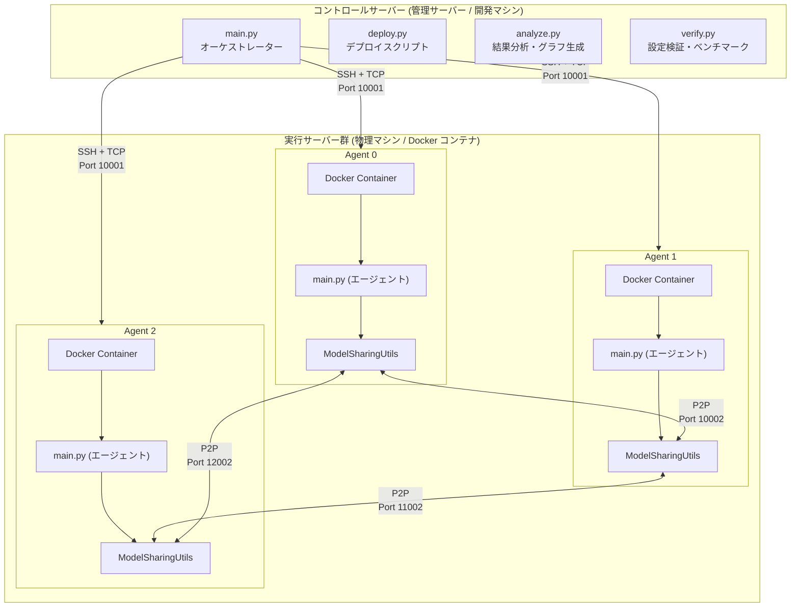
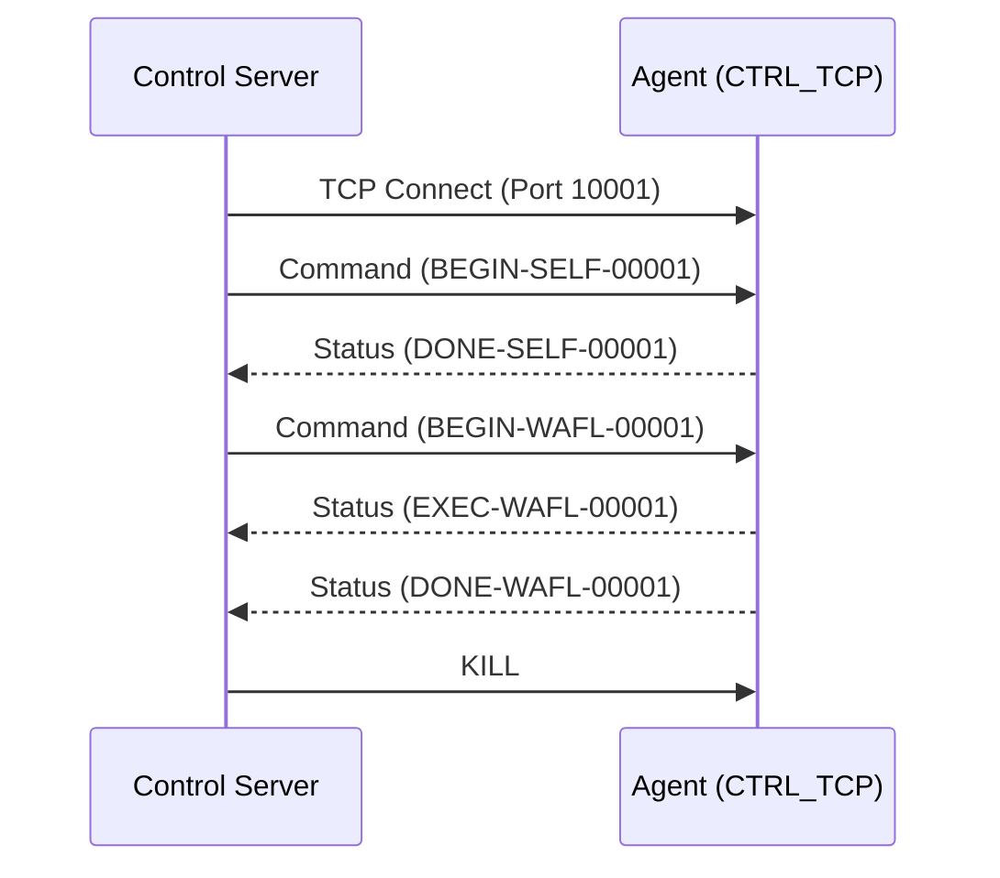
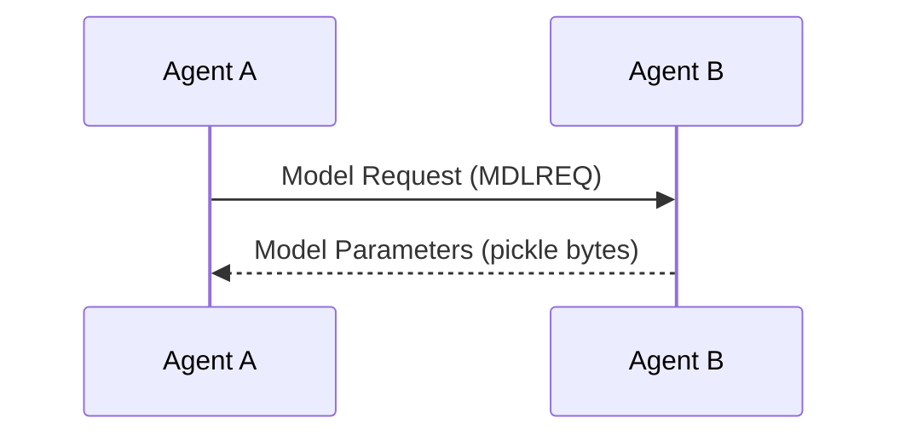
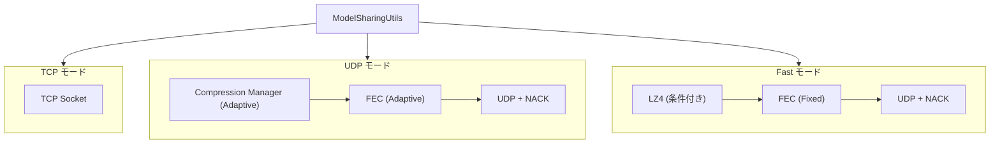
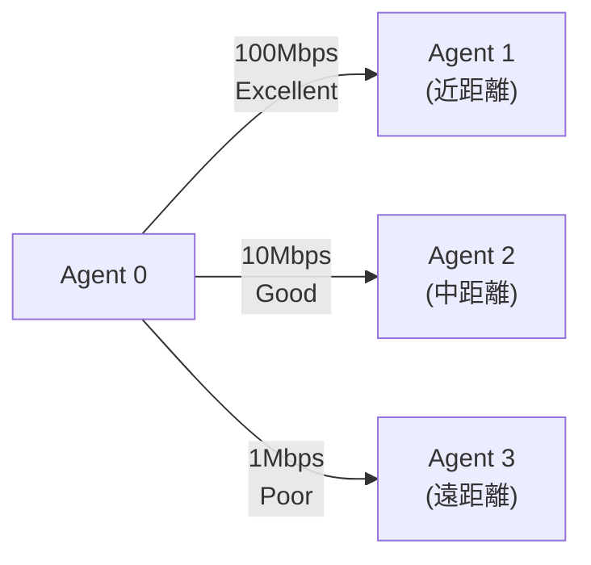
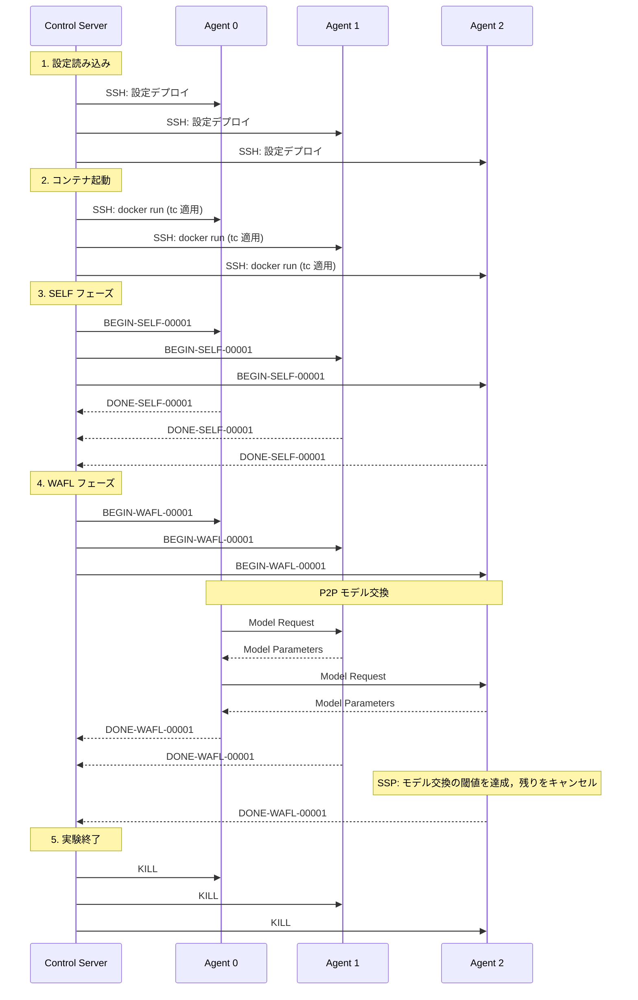
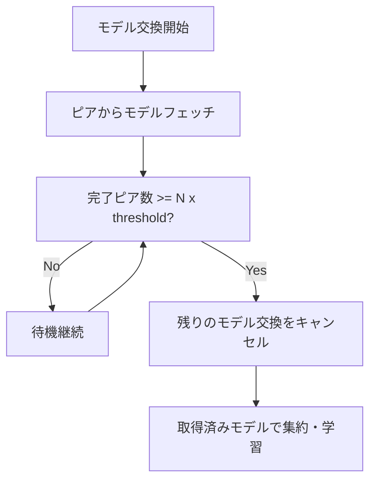

# システムアーキテクチャ / System Architecture

**日本語** | [English](#english-version)

---

## 日本語版

### 概要

WAFL-Testbed は，Device-to-Device (D2D) 連合学習を実 TCP/IP ネットワーク上でエミュレートするための研究プラットフォームである．シミュレーションでは再現困難な実環境制約（OS レイヤ遅延，物理リソース競合，ネットワークスタック挙動）を定量化できる．

---

### 全体アーキテクチャ



---

### システムコンポーネント

#### 1. コントロールサーバー (Control Server)

**役割**: 実験のオーケストレーター

**責務**:
- 全エージェントへの設定・コードデプロイを行う．
- 実験ライフサイクル管理（開始，停止，クリーンアップ）を担う．
- ログおよび結果の収集を行う．
- 学習プロセスの同期制御（BSP）を実行する．
- SSP 設定の実行サーバへの共有を行う（実際の SSP 制御は各実行サーバが自律的に実行する）．
- ネットワーク条件（帯域・遅延・損失）のエミュレーション制御を行う．

**実装**: `ctrl/main.py`

**主要クラス**:

| クラス                 | 責務                                   |
| ---------------------- | -------------------------------------- |
| `ControlServer`        | 実験全体の制御，エージェント管理       |
| `WaflAgent`            | 各エージェントとの通信インターフェース |
| `ContainerManager`     | Docker コンテナのライフサイクル管理    |
| `SSHConnectionManager` | SSH 接続のプーリングと再利用           |

**動作フロー**:
1. `execution_config.json` と `parameters.json` を読み込む．
2. 全エージェントに SSH 経由で設定をデプロイする．
3. Docker コンテナを起動する（リソース制限を適用する）．
4. ネットワークエミュレーション (tc/netem) を適用する．
5. SELF フェーズおよび WAFL フェーズの順に実行を指示する．
6. エポックごとに同期制御を行う（BSP: 全ノード待機，SSP: 各実行サーバが自律的に判定）．
7. 実験終了後，全エージェントを正常終了させる．

#### 2. 実行サーバー (Execution Servers / Agents)

**役割**: 実際のモデル学習を実行するワーカーノード

**責務**:
- ローカル学習（SELF フェーズ）を実行する．
- モデルパラメータ交換（WAFL フェーズ）を実行する．
- リソース使用量のモニタリングを行う．
- 構造化ログ（JSON Lines）を出力する．

**実装**: `wafl/src/common/main.py`

**主要クラス**:

| クラス               | 責務                         |
| -------------------- | ---------------------------- |
| `CTRL_TCP`           | コントロールサーバーとの通信 |
| `ModelLearningUtils` | 学習ロジック (SELF/WAFL)     |
| `ModelSharingUtils`  | P2P モデル交換 (TCP / UDP)   |
| `UDPModelSharing`    | UDP + FEC によるモデル共有   |
| `CompressionManager` | 適応的圧縮                   |
| `NetworkEstimator`   | ネットワーク状態推定         |
| `MetricsLogger`      | JSON Lines 形式のログ出力    |

**デプロイ方式**: Docker コンテナとして起動し，環境の一貫性と分離を保証する．

---

### 通信フロー

#### 1. 制御通信 (Control Communication)



**プロトコル**: TCP  
**デフォルトポート**: 10001（コンテナ内），設定可能（ホスト側）

**コマンド (Control Server → Agent)**:
| コマンド             | 形式               | 説明                                                                  |
| -------------------- | ------------------ | --------------------------------------------------------------------- |
| `BEGIN-SELF-{epoch}` | `BEGIN-SELF-00001` | SELF 学習開始                                                         |
| `BEGIN-WAFL-{epoch}` | `BEGIN-WAFL-00100` | WAFL 学習開始                                                         |
| `STAT`               | `STAT`             | ステータス要求                                                        |
| `FORCE_NEXT`         | `FORCE_NEXT`       | SSP Reset: 現在のエポックを強制終了（後方互換用，通常は使用されない） |
| `KILL`               | `KILL`             | プロセス正常終了                                                      |

**レスポンス (Agent → Control Server)**:
| ステータス             | 形式              | 説明       |
| ---------------------- | ----------------- | ---------- |
| `READY`                | `READY`           | 待機中     |
| `EXEC-{phase}-{epoch}` | `EXEC-WAFL-00100` | 実行中     |
| `DONE-{phase}-{epoch}` | `DONE-WAFL-00100` | 完了       |
| `ERROR`                | `ERROR`           | エラー発生 |

#### 2. P2P データ共有 (Model Exchange)



**プロトコル**: TCP または UDP（設定可能）  
**デフォルトポート**: 10002

詳細: [docs/protocol.md](protocol.md)

---

### 3 つの通信モード

#### モード選択

```json
{
  "method": "tcp",      // TCP モード
  "method": "udp",      // UDP モード
  "method": "fast"      // Fast モード
}
```

#### アーキテクチャ図



---

### ネットワークエミュレーション

実環境を模擬するため，Linux の TC ツール (`tc`, `netem`) を使用してネットワーク条件を制御する．

#### 実装方式

```bash
# コンテナの仮想イーサネット (eth0) に tc ルールを適用
tc qdisc add dev eth0 root netem \
  delay 50ms \          # 遅延
  loss 3% \             # パケットロス率
  rate 10mbit           # 帯域制限
```

#### 静的 vs 動的ネットワーク条件

| 方式     | 説明                         | 設定                |
| -------- | ---------------------------- | ------------------- |
| **静的** | 実験中一定のネットワーク条件 | `network_condition` |
| **動的** | ノード間距離に応じて変化     | `mobility_aware`    |

詳細: [docs/mobility_aware.md](mobility_aware.md)

#### Per-Peer Limitation

Mobility-Aware モードでは，HTB + Filter を使用して通信相手ごとに異なるネットワーク制限を適用：



---

### リソース制限

Docker の `--cpus` オプションで CPU 使用率を制限し，性能が異なる種々のデバイスを模擬する．

> **Note**: CPU 制限は WAFL フェーズ開始時に `docker update` で動的に適用される．SELF フェーズ（ローカル学習）では制限なしで実行されるため，事前学習の時間を短縮できる．

**設定例**:
```json
{
  "name": 0,
  "cpu_limit": "1.0"  // 1 コア分に制限
}
```

| cpu_limit | 意味                 |
| --------- | -------------------- |
| `"1.0"`   | 1 CPU コア（100 %）  |
| `"0.5"`   | 0.5 CPU コア（50 %） |
| `"2.0"`   | 2 CPU コア（200 %）  |

---

### ソフトウェアスタック

| カテゴリ           | 使用技術            | 用途               |
| ------------------ | ------------------- | ------------------ |
| **言語**           | Python 3.11+        | 全コンポーネント   |
| **深層学習**       | PyTorch             | モデル学習・推論   |
| **コンテナ化**     | Docker              | 実行環境分離       |
| **パッケージ管理** | uv                  | 依存関係管理       |
| **タスクランナー** | mise                | ワークフロー自動化 |
| **SSH 自動化**     | Paramiko            | リモート制御       |
| **FEC**            | zfec                | 誤り訂正符号       |
| **圧縮**           | zlib, lz4           | データ圧縮         |
| **可視化**         | matplotlib, seaborn | グラフ生成         |

---

### データフロー



---

### SSP (Semi-Synchronous Protocol) 実装

#### 動作原理（実行サーバ自律型）

1. **設定受信**: 管理サーバから `config.json` 経由で `ssp_enabled` と `ssp_threshold` を受け取る
2. **モデル交換監視**: 各実行サーバが `wafl_learn` のモデル交換時に完了ピアの割合を監視
3. **閾値判定**: `完了ピア数 / 総ピア数 >= ssp_threshold` に達したら残りのモデル交換をキャンセル
4. **メトリクス記録**: 破棄された計算量（`wasted_ms`, `wasted_norm`）を記録



#### SSP vs BSP 比較

| 方式    | 同期         | メリット | デメリット               |
| ------- | ------------ | -------- | ------------------------ |
| **BSP** | 全ノード待機 | 精度保証 | 遅いノードがボトルネック |
| **SSP** | 閾値で進行   | 高速     | 計算破棄が発生           |

---

## English Version

### Overview

WAFL-Testbed is a research platform for emulating Device-to-Device (D2D) Federated Learning over real TCP/IP networks. It quantifies **real-world constraints** difficult to reproduce in simulations: OS-layer latency, physical resource contention, and network stack behavior.

### System Components

#### 1. Control Server

**Role**: Experiment Orchestrator

**Responsibilities**:
- Deploy configuration and code to all agents
- Manage experiment lifecycle (Start, Stop, Cleanup)
- Collect logs and results
- Share SSP settings with execution servers (SSP control is autonomous per execution server)

**Implementation**: [`ctrl/main.py`](file:///home/ktakahashi/workspace/wafl/WAFL-Testbed/ctrl/main.py)

**Main Classes**:
- `ControlServer`: Overall experiment control
- `WaflAgent`: Communication interface with each agent
- `ContainerManager`: Docker container lifecycle management
- `SSHConnectionManager`: SSH connection pooling and reuse

#### 2. Execution Servers (Agents)

**Role**: Worker nodes executing actual model training

**Responsibilities**:
- Local training (SELF phase)
- Model parameter exchange (WAFL phase)
- Resource usage monitoring
- Structured logging output (JSON Lines)

**Implementation**: [`wafl/src/common/main.py`](file:///home/ktakahashi/workspace/wafl/WAFL-Testbed/wafl/src/common/main.py)

**Main Classes**:
- `CTRL_TCP`: Communication with Control Server
- `ModelLearningUtils`: Learning logic (SELF/WAFL)
- `ModelSharingUtils`: P2P model exchange (TCP / UDP)
- `UDPModelSharing`: UDP+FEC model sharing
- `CompressionManager`: Adaptive compression
- `NetworkEstimator`: Network state estimation
- `MetricsLogger`: JSON Lines format log output

**Deployment**: Launched as Docker containers (ensuring environment consistency and isolation)

### Three Communication Modes

| Mode     | Protocol           | Reliability   | Use Case                |
| -------- | ------------------ | ------------- | ----------------------- |
| **TCP**  | Standard TCP       | TCP guarantee | Stable networks         |
| **UDP**  | UDP + Adaptive FEC | FEC + NACK    | Unstable networks       |
| **Fast** | UDP + Fixed FEC    | Minimal FEC   | High-bandwidth networks |

Details: [docs/protocol.md](protocol.md)

### SSP (Semi-Synchronous Protocol)

1. **Configuration Sharing**: Each execution server receives `ssp_enabled` and `ssp_threshold` from control server via `config.json`
2. **Model Exchange Monitoring**: Each execution server monitors completed peer ratio during `wafl_learn` model exchange
3. **Threshold Decision**: When `completed_peers / total_peers >= ssp_threshold`, remaining model exchanges are cancelled
4. **Metrics Logging**: Record discarded computation (`wasted_ms`, `wasted_norm`)
