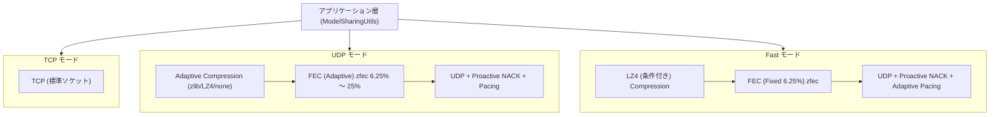
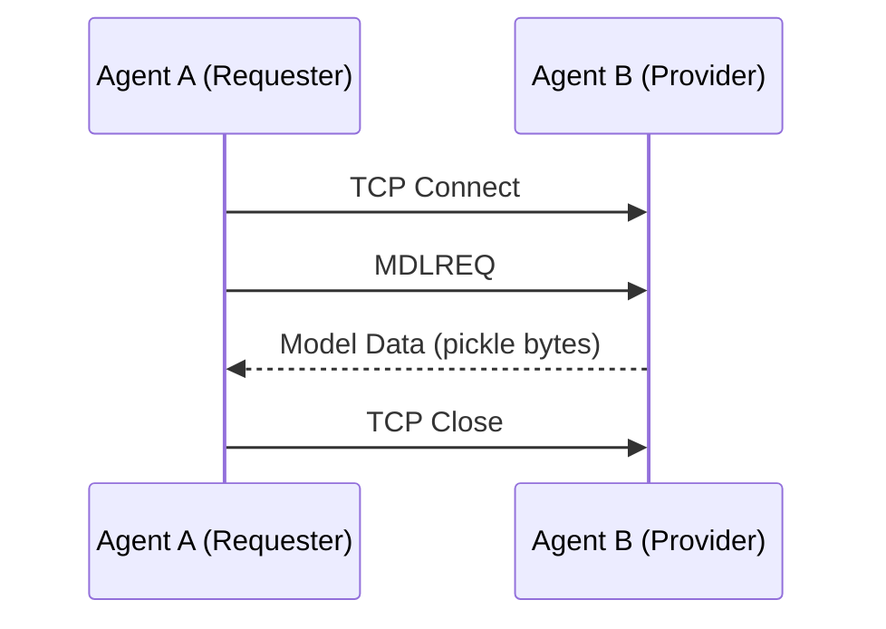
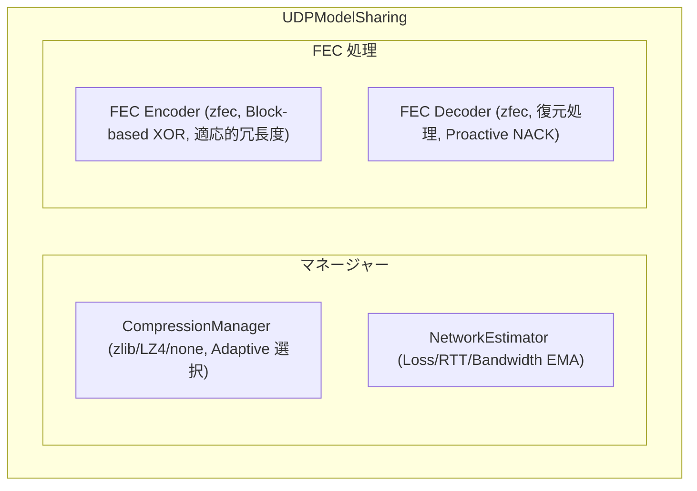
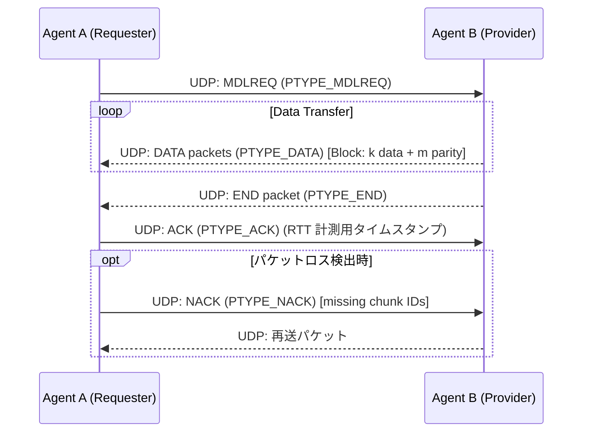
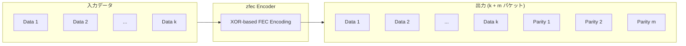

# 通信プロトコル詳細 / Communication Protocol Details

**日本語** | [English](#english-version)

---

## 日本語版

WAFL-Testbed は 3 つの通信モードを提供し，それぞれ異なるプロトコルスタックと最適化戦略を持つ．本ドキュメントでは各モードの実装詳細を解説する．

---

### 1. プロトコルスタック概要



---

### 2. TCP モード

#### 2.1 概要

TCP モードは標準的な TCP ソケット通信を使用する．信頼性は TCP プロトコル自体に委譲し，アプリケーション層ではシンプルなリクエスト・レスポンス方式でモデル交換を行う．

#### 2.2 通信フロー



#### 2.3 パケット形式

**リクエスト**: `MDLREQ\r\n` (7 bytes)．これはモデルデータの送信を要求するコマンドである．

**レスポンス**: 
```
[4 bytes: データ長 (big-endian)] + [可変長: pickle 化されたモデルデータ]
```
データ長を先頭に付与することで，受信側は正確なバイト数を把握して読み込みを完了できる．

#### 2.4 タイムアウト設定

TCP モードにおけるタイムアウト値は以下の通りである．

| パラメータ       | 値    | 説明                             |
| ---------------- | ----- | -------------------------------- |
| 接続タイムアウト | 10 秒 | TCP ハンドシェイクの最大待機時間 |
| 受信タイムアウト | 10 秒 | データ受信の最大待機時間         |
| リトライ回数     | 1 回  | 失敗時の再試行回数               |

#### 2.5 実装ファイル

- `wafl/src/common/main.py`: `ModelSharingUtils._fetch_model()` (TCP ブランチ)
- `wafl/src/common/main.py`: `ModelSharingUtils._dispatch_model()`

---

### 3. UDP モード

#### 3.1 概要

UDP モードは UDP + FEC (Forward Error Correction) を使用し，無線環境等のパケットロスが発生しやすい状況においても FEC 冗長度と圧縮方式を動的に調整することで効率的なデータ転送を実現する．

#### 3.2 コンポーネント構成



#### 3.3 通信フロー



#### 3.4 パケット形式

**ヘッダ構造** (32 bytes):
各パケットの先頭には固定長のバイナリヘッダが付与される．

| フィールド   | サイズ | 説明                     |
| ------------ | ------ | ------------------------ |
| PTYPE        | 1 B    | パケットタイプ           |
| Timestamp    | 8 B    | RTT 計測用タイムスタンプ |
| Model Seq    | 4 B    | モデルシーケンス番号     |
| Chunk Index  | 4 B    | チャンクインデックス     |
| Total Chunks | 4 B    | 総チャンク数             |
| Block Index  | 4 B    | ブロックインデックス     |
| Original Len | 4 B    | 元データ長               |
| $k$          | 1 B    | データパケット数         |
| $m$          | 1 B    | パリティパケット数       |
| Reserved     | 1 B    | 予約                     |

**パケットタイプ (PTYPE)**:

| 値  | 名称         | 説明                   |
| --- | ------------ | ---------------------- |
| 0   | PTYPE_DATA   | データパケット         |
| 1   | PTYPE_NACK   | 否定応答（再送要求）   |
| 2   | PTYPE_MCAST  | マルチキャスト（予約） |
| 3   | PTYPE_ACK    | 肯定応答               |
| 4   | PTYPE_END    | 送信完了通知           |
| 5   | PTYPE_MDLREQ | モデル要求             |
| 6   | PTYPE_ABORT  | 中断通知               |

#### 3.5 FEC (Forward Error Correction)

**アルゴリズム**: zfec ライブラリを用いた Block-based XOR 符号である．

**ブロック構成**:
- $k$ 個のデータパケット + $m$ 個のパリティパケット
- 1 ブロック内で受信したパケットの総数が $k$ 個以上であれば，元のデータを完全に復元可能である．再送回数を減らすことで，高遅延環境においてスループットを維持する．



**適応的冗長度**:
`NetworkEstimator` が算出したパケット損失率に基づき，冗長度 $m$ を決定する．

```python
def get_recommended_fec_parity(self, k: int, peer_ip: str = None):
    metrics = self.get_metrics(peer_ip)
    loss_rate = metrics.packet_loss_rate
    
    if loss_rate < 0.02:
        return 1  # 最小冗長度 (6.25 %)
    elif loss_rate < 0.05:
        return 2  # 12.5 %
    elif loss_rate < 0.10:
        return 3  # 18.75 %
    else:
        return 4  # 最大冗長度 (25 %)
```

**FEC 冗長率**:
$$\text{冗長率} = \frac{m}{k + m}$$

| $m$ (parity) | $k=16$ での冗長率 | 推奨損失率  |
| ------------ | ----------------- | ----------- |
| 1            | 6.25 %            | 0 % 〜 2 %  |
| 2            | 12.5 %            | 2 % 〜 5 %  |
| 3            | 18.75 %           | 5 % 〜 10 % |
| 4            | 25 %              | 10 % 〜     |

#### 3.6 Proactive NACK

通常の NACK は送信完了通知 (END) を受領した後に欠損パケットを特定して発行されるが，本システムでは遅延短縮のために **Proactive NACK** を採用している．

```python
# パケット受信の間隔がしきい値を超えた場合，END を待たずに NACK を発行する
INTER_PACKET_TIMEOUT = 0.1  # 100 ms

def _check_peer_timeouts(self, peer_ip, incoming_models):
    for model_seq, state in list(incoming_models.items()):
        if not state.end_received:
            time_since_last = time.time() - state.last_packet_time
            if time_since_last > self.inter_packet_timeout:
                # Proactive NACK の実行
                missing = self._identify_missing_chunks(state)
                if missing:
                    self._send_nack(peer_ip, model_seq, missing)
```

#### 3.7 Adaptive Compression

`CompressionManager` が帯域幅と計算速度のバランスを評価し，最適な圧縮アルゴリズムを選択する．

```python
# 期待される総時間を最小化するアルゴリズムを選択する
T_est = T_comp + (Size_comp * R) / BW

# T_comp: 圧縮時間
# Size_comp: 圧縮後サイズ
# R: FEC 冗長増加係数 (1 + m/(k+m))
# BW: 推定帯域幅
```

**サポート圧縮方式**:

| 方式 | 圧縮率          | 処理速度 | 主な用途   |
| ---- | --------------- | -------- | ---------- |
| none | 1.0             | -        | 高帯域環境 |
| lz4  | 0.5 〜 0.7 程度 | 500 MB/s | 標準環境   |
| zlib | 0.3 〜 0.5 程度 | 50 MB/s  | 低帯域環境 |

#### 3.8 Pacing

急激なバーストトラフィックによるネットワーク飽和を防ぐため，送信間隔を微調整するペーシングを適用する．

#### 3.9 実装ファイル

- `wafl/src/common/udp_model_sharing.py`: `UDPModelSharing` クラス
- `wafl/src/common/compression_manager.py`: `CompressionManager` クラス
- `wafl/src/common/network_estimator.py`: `NetworkEstimator` クラス

---

### 4. Fast モード

#### 4.1 概要

Fast モードは UDP モードの派生であり，高帯域・低遅延な環境においてオーバーヘッドを最小化するための最適化が施されている．

#### 4.2 UDP モードとの差異

| 項目             | UDP                     | Fast                 |
| ---------------- | ----------------------- | -------------------- |
| FEC 冗長度       | 適応的 (6.25 % 〜 25 %) | 固定 (6.25 %)        |
| 圧縮方式         | 適応的 (zlib/LZ4/none)  | LZ4 またはスキップ   |
| 圧縮スキップ条件 | なし                    | 帯域幅 > 50 Mbps     |
| 送信制御         | 通常ペーシング          | 高速化パラメータ適用 |

#### 4.3 条件付き圧縮スキップ

帯域幅が十分に広い（50 Mbps を超える）と推定される場合，圧縮処理自体のオーバーヘッドを避けるため無圧縮で送信を行う．

---

### 5. NetworkEstimator の詳細

#### 5.1 概要

ネットワークの状態を実測値から統計的に推定するコンポーネントである．

#### 5.2 測定メトリクス

| メトリクス           | 測定方法                 | 用途             |
| -------------------- | ------------------------ | ---------------- |
| **Packet Loss Rate** | 受領パケットと NACK 比率 | FEC 冗長度調整   |
| **RTT**              | ACK の往復時間           | タイムアウト制御 |
| **Bandwidth**        | 実効スループットの計測   | 圧縮方式選択     |

#### 5.3 EMA (指数移動平均) による平滑化

一時的なノイズを除去するため，すべての推定値は EMA を通して算出される．

$$V_{new} = \alpha \cdot Sample + (1 - \alpha) \cdot V_{old}$$

デフォルトでは $\alpha = 0.3$ を採用しており，直近 3 割の重みを新しいサンプルに与えている．

#### 5.4 Per-Peer 状態管理

グローバル状態とピアごとの状態を独立に管理する．

```python
# グローバル状態（全ピア平均）
estimator.get_metrics()

# ピアごとの状態
estimator.get_metrics(peer_ip="192.168.11.100")
```

---

## English Version

### Overview

WAFL-Testbed provides three core communication modes, each with localized optimization strategies for federated learning in wireless environments.

### 1. TCP Mode

Standard TCP socket communication. Reliability is managed by the kernel TCP stack. Suitable for stable wired/low-loss wireless environments.

### 2. UDP Mode

Adaptive UDP + FEC implementation designed for wireless paths with frequent packet loss.
- **FEC (zfec)**: Uses k=16 block encoding with adaptive parity m (6.25% to 25%).
- **Adaptive Compression**: Dynamically switches between zlib, LZ4, or none based on current bandwidth.
- **Proactive NACK**: Detects packet loss before receiving the END packet to minimize recovery latency.

### 3. Fast Mode

Optimized variant of the UDP mode for high-speed local networks. 
- Fixed FEC at 6.25% redundancy.
- Disables compression if estimated bandwidth exceeds 50 Mbps.
- Optimized task scheduling for high-throughput model exchange.

### 4. NetworkEstimator

Monitors per-peer network conditions using real traffic data:
- **Packet Loss Rate**: Calculated from byte arrival ratios.
- **RTT**: Measured via ACK/MDLREQ round trips.
- **Bandwidth**: Measured from actual payload delivery speeds.
- All metrics are smoothed using Exponential Moving Average (EMA) with $\alpha=0.3$.
