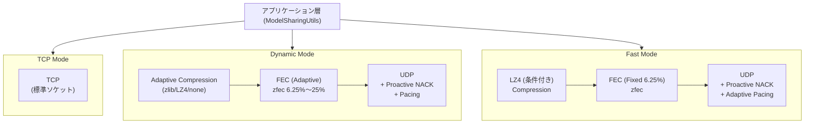
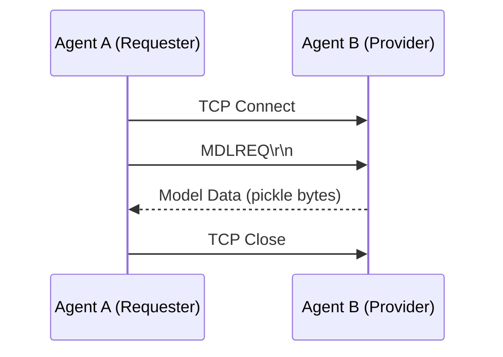
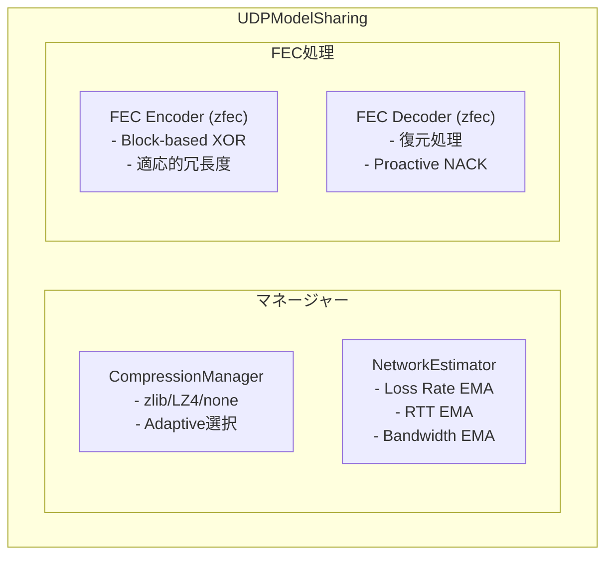
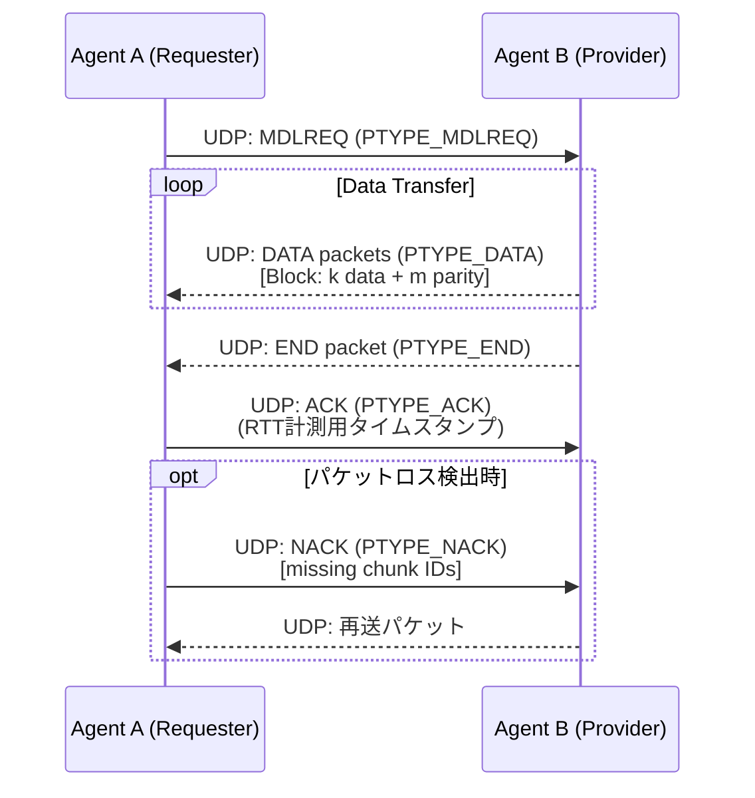
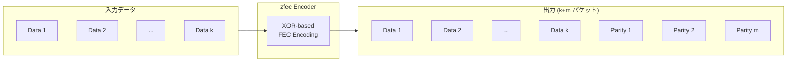
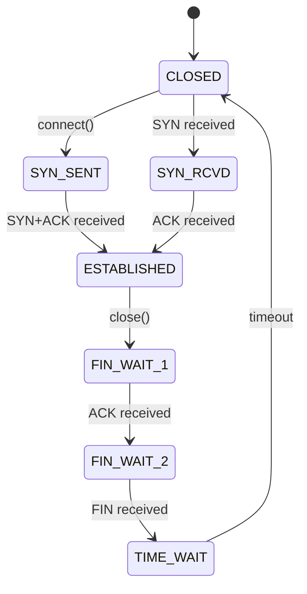

# 通信プロトコル詳細 / Communication Protocol Details

**日本語** | [English](#english-version)

---

## 日本語版

WAFL-Testbed は 3 つの通信モードを提供し，それぞれ異なるプロトコルスタックと最適化戦略を持つ．本ドキュメントでは各モードの実装詳細を解説する．

---

### 1. プロトコルスタック概要



---

### 2. TCP モード

#### 2.1 概要

TCP モードは標準的な TCP ソケット通信を使用する．信頼性は TCP プロトコル自体に委譲し，アプリケーション層ではシンプルなリクエスト・レスポンス方式でモデル交換を行う．

#### 2.2 通信フロー



#### 2.3 パケット形式

**リクエスト**: `MDLREQ\r\n` (7 bytes)

**レスポンス**: 
```
[4 bytes: データ長 (big-endian)] + [可変長: pickle 化されたモデルデータ]
```

#### 2.4 タイムアウト設定

| パラメータ       | 値   | 説明                             |
| ---------------- | ---- | -------------------------------- |
| 接続タイムアウト | 10秒 | TCP ハンドシェイクの最大待機時間 |
| 受信タイムアウト | 10秒 | データ受信の最大待機時間         |
| リトライ回数     | 1回  | 失敗時の再試行回数（デフォルト） |

#### 2.5 実装ファイル

- `wafl/src/common/main.py`: `ModelSharingUtils._fetch_model()` (TCP ブランチ)
- `wafl/src/common/main.py`: `ModelSharingUtils._dispatch_model()`

---

### 3. Dynamic モード

#### 3.1 概要

Dynamic モードは UDP + FEC (Forward Error Correction) を使用し，ネットワーク状態に応じてパラメータを動的に調整する．

#### 3.2 コンポーネント構成



#### 3.3 通信フロー



#### 3.4 パケット形式

**ヘッダ構造** (32 bytes):

| フィールド   | サイズ | 説明                    |
| ------------ | ------ | ----------------------- |
| PTYPE        | 1B     | パケットタイプ          |
| Timestamp    | 8B     | RTT計測用タイムスタンプ |
| Model Seq    | 4B     | モデルシーケンス番号    |
| Chunk Index  | 4B     | チャンクインデックス    |
| Total Chunks | 4B     | 総チャンク数            |
| Block Index  | 4B     | ブロックインデックス    |
| Original Len | 4B     | 元データ長              |
| k            | 1B     | データパケット数        |
| m            | 1B     | パリティパケット数      |
| Reserved     | 1B     | 予約                    |

**パケットタイプ (PTYPE)**:

| 値  | 名称         | 説明                   |
| --- | ------------ | ---------------------- |
| 0   | PTYPE_DATA   | データパケット         |
| 1   | PTYPE_NACK   | 否定応答（再送要求）   |
| 2   | PTYPE_MCAST  | マルチキャスト（予約） |
| 3   | PTYPE_ACK    | 肯定応答               |
| 4   | PTYPE_END    | 送信完了通知           |
| 5   | PTYPE_MDLREQ | モデル要求             |
| 6   | PTYPE_ABORT  | 中断通知               |

#### 3.5 FEC (Forward Error Correction)

**アルゴリズム**: Block-based XOR using zfec library

**ブロック構成**:
- k 個のデータパケット + m 個のパリティパケット
- 1 ブロック内で任意の k 個のパケットが到着すれば復元可能



**適応的冗長度**:

```python
# NetworkEstimator による推奨 FEC parity 計算
def get_recommended_fec_parity(self, k: int, peer_ip: str = None):
    metrics = self.get_metrics(peer_ip)
    loss_rate = metrics.packet_loss_rate
    
    if loss_rate < 0.02:
        return 1  # 最小冗長度 (6.25%)
    elif loss_rate < 0.05:
        return 2  # 12.5%
    elif loss_rate < 0.10:
        return 3  # 18.75%
    else:
        return 4  # 最大冗長度 (25%)
```

**FEC 冗長率**:
$$\text{冗長率} = \frac{m}{k + m}$$

| parity (m) | k=16 での冗長率 | 推奨損失率 |
| ---------- | --------------- | ---------- |
| 1          | 6.25%           | 0%〜2%     |
| 2          | 12.5%           | 2%〜5%     |
| 3          | 18.75%          | 5%〜10%    |
| 4          | 25%             | 10%〜      |

#### 3.6 Proactive NACK

従来の NACK は END パケット受信後に発行されるが，Dynamic モードでは**Proactive NACK**を実装：

```python
# パケット受信が一定時間停滞した場合，ENDを待たずにNACK発行
INTER_PACKET_TIMEOUT = 0.1  # 100ms

def _check_peer_timeouts(self, peer_ip, incoming_models):
    for model_seq, state in list(incoming_models.items()):
        if not state.end_received:
            time_since_last = time.time() - state.last_packet_time
            if time_since_last > self.inter_packet_timeout:
                # Proactive NACK 発行
                missing = self._identify_missing_chunks(state)
                if missing:
                    self._send_nack(peer_ip, model_seq, missing)
```

#### 3.7 Adaptive Compression

**CompressionManager** が帯域と計算負荷に応じて圧縮方式を選択：

```python
# 推定転送時間を最小化する方式を選択
T_est = T_comp + (Size_comp × R) / BW

# where:
#   T_comp: 圧縮時間
#   Size_comp: 圧縮後サイズ
#   R: FEC 冗長率 = 1 + m/(k+m)
#   BW: 推定帯域（EMA で更新）
```

**サポート圧縮方式**:

| 方式 | 圧縮率   | 速度    | 用途       |
| ---- | -------- | ------- | ---------- |
| none | 1.0      | -       | 高帯域環境 |
| lz4  | 0.5〜0.7 | 500MB/s | バランス型 |
| zlib | 0.3〜0.5 | 50MB/s  | 低帯域環境 |

#### 3.8 Pacing

ネットワーク輻輳を防ぐため，パケット送信にペーシング（間隔制御）を適用：

```python
def get_recommended_pacing_delay(self, peer_ip: str = None):
    metrics = self.get_metrics(peer_ip)
    rtt = metrics.rtt_ms
    
    if rtt < 10:
        return 0.0001  # 0.1ms
    elif rtt < 50:
        return 0.0002  # 0.2ms
    else:
        return 0.0005  # 0.5ms
```

#### 3.9 実装ファイル

- `wafl/src/common/udp_model_sharing.py`: `UDPModelSharing` クラス
- `wafl/src/common/compression_manager.py`: `CompressionManager` クラス
- `wafl/src/common/network_estimator.py`: `NetworkEstimator` クラス

---

### 4. Fast モード

#### 4.1 概要

Fast モードは Dynamic モードをベースに，高帯域・低損失環境向けの最適化を適用する．

#### 4.2 Dynamic モードとの差異

| 項目             | Dynamic                | Fast                 |
| ---------------- | ---------------------- | -------------------- |
| FEC 冗長度       | 適応的 (6.25%〜25%)    | 固定 (6.25%)         |
| 圧縮             | 適応的 (zlib/LZ4/none) | LZ4 または スキップ  |
| 圧縮スキップ条件 | -                      | 帯域 > 50Mbps        |
| バッチサイズ     | 固定                   | RTT に応じて動的調整 |

#### 4.3 条件付き圧縮スキップ

```python
# 高帯域環境では圧縮をスキップ
def compress(self, data: bytes):
    bandwidth = self.network_estimator.get_metrics().bandwidth_mbps
    
    if bandwidth > 50:  # 50Mbps 以上
        return data, "none"  # 圧縮スキップ
    else:
        return self._compress_lz4(data), "lz4"
```

#### 4.4 動的バッチサイズ

RTT に応じてパケット送信のバッチサイズを調整：

```python
def get_batch_size(self, rtt_ms: float):
    if rtt_ms < 10:
        return 64
    elif rtt_ms < 50:
        return 32
    else:
        return 16
```

---

### 5. RUDP プロトコル（実験的）

WAFL-Testbed には RUDP (Reliable UDP) プロトコルの実装も含まれている．

#### 5.1 概要

RUDP は TCP ライクな接続指向の通信を UDP 上で実現する．Selective Repeat ARQ とスライディングウィンドウによる信頼性確保を行う．

#### 5.2 パケット構造

| フィールド | サイズ | 説明           |
| ---------- | ------ | -------------- |
| Flags      | 1B     | フラグビット   |
| HeaderLen  | 1B     | ヘッダ長       |
| SeqNum     | 4B     | シーケンス番号 |
| AckNum     | 4B     | ACK 番号       |
| Checksum   | 4B     | チェックサム   |
| Reserved   | 6B     | 予約           |
| Payload    | 可変   | ペイロード     |

**フラグ**:

| フラグ | 値   | 説明           |
| ------ | ---- | -------------- |
| SYN    | 0x80 | 接続開始       |
| ACK    | 0x40 | 確認応答       |
| EAK    | 0x20 | 拡張確認応答   |
| RST    | 0x10 | 接続リセット   |
| NUL    | 0x08 | ヌルパケット   |
| FIN    | 0x04 | 接続終了       |
| DATA   | 0x02 | データパケット |

#### 5.3 接続状態



#### 5.4 実装ファイル

- `wafl/src/common/rudp_protocol.py`: `RUDPSocket` クラス
- `wafl/src/common/rudp_connection_pool.py`: コネクションプール管理
- `wafl/src/common/rudp_model_sharing.py`: RUDP 用モデル共有

---

### 6. NetworkEstimator の詳細

#### 6.1 概要

NetworkEstimator はネットワーク状態を実測データから推定し，各種パラメータの動的調整に使用される．

#### 6.2 測定メトリクス

| メトリクス           | 測定方法                | 用途           |
| -------------------- | ----------------------- | -------------- |
| **Packet Loss Rate** | ACK/NACK 比率           | FEC 冗長度調整 |
| **RTT**              | ACK タイムスタンプ      | ペーシング調整 |
| **Bandwidth**        | 転送バイト数 / 転送時間 | 圧縮方式選択   |

#### 6.3 EMA (指数移動平均) による平滑化

```python
# 新しいサンプルを EMA で統合
new_estimate = α × sample + (1 - α) × old_estimate

# α = 0.3 (デフォルト)
# 直近のサンプルに 30% の重みを与える
```

#### 6.4 Per-Peer 状態管理

グローバル状態とピアごとの状態を独立に管理：

```python
# グローバル状態（全ピア平均）
estimator.get_metrics()

# ピアごとの状態
estimator.get_metrics(peer_ip="192.168.11.100")
```

---

## English Version

### Overview

WAFL-Testbed provides three communication modes with different protocol stacks and optimization strategies.

### 1. TCP Mode

Uses standard TCP socket communication. Reliability is delegated to the TCP protocol itself.

### 2. Dynamic Mode

Uses UDP + FEC with adaptive parameter tuning based on network conditions.

**Key Components**:
- **FEC (zfec)**: Block-based XOR with adaptive redundancy (6.25% ~ 25%)
- **Adaptive Compression**: Dynamic selection between zlib, LZ4, or none
- **Proactive NACK**: Early loss detection and recovery
- **Pacing**: Rate-controlled packet transmission

### 3. Fast Mode

Based on Dynamic mode with optimizations for high-bandwidth, low-loss environments.

**Differences from Dynamic**:
- Fixed FEC redundancy (6.25%)
- Compression skip when bandwidth > 50Mbps
- Dynamic batch sizing based on RTT

### 4. NetworkEstimator

Estimates network conditions from observed measurements:
- Packet loss rate (ACK/NACK ratio)
- RTT (ACK timestamp)
- Bandwidth (bytes / duration)

All metrics are smoothed using EMA (Exponential Moving Average).
