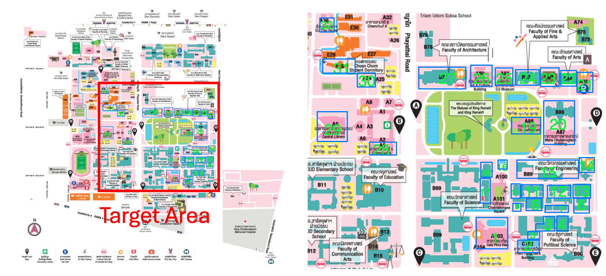

# CUBR Report

This README explains the Chulalongkorn University Building Recognition Dataset (CUBR).

## Background

In previous research on the UTBR Dataset, it was demonstrated that WAFL is effective for the UTBR Dataset, which consists of 10 labeled buildings. However, there is a lack of research examining how WAFL performs under conditions different from UTBR.

In our research, we investigate the performance of WAFL on a different dataset. To evaluate the robustness of WAFL, we constructed a new dataset, the Chulalongkorn University Buildings Recognition Dataset (CUBR), which contains 32 labeled buildings.

In our experiment, we evaluated WAFL using different models, including Resnet, VGG, Mobilenet, and ViT with 10 nodes. As a result of our experiment, we found that WAFL also works effectively with the CUBR dataset.

In conclusion, our contributions are as follows:
- Constructed a new dataset containing 32 buildings.
- Demonstrated that WAFL works under condition different from UTBR, indicating the robustness of WAFL.

## Chulalongkorn Building Recognition Dataset



We have developed the Chulalongkorn University Building Recognition Dataset (CUBR) to provide smart-campus services. The photos were captured by three individuals using their own cameras.
We selected 32 buildings as the target for these photographs, and each photo was manually labeled.

To simulate a scenario where labels are uniformly distributed across devices, we pre-processed the photos and distributed them to ten virtual devices. This scenario is referred to as the IID-case.

## Experimental Results

Notations of SELF-ViT and WAFL-ViT follow from previous research [1]. 
Also, parameter configurations of models and virtual areas follow from previous research [1].
For SELF-ViT, training is conducted under the condition where 32 buildings are used with 10 virtual devices.

For SELF-\*, we carried out simulations up to 1000 epochs. 
For WAFL-\*, we conducted 500 epochs of self-training and 500 epochs of collaborative training.

| Model         | Accuracy     | Standard Deviation |
|---------------|--------------|--------------------|
| WAFL-ViT      | **0.810381773**  | 0.01248877         |
| WAFL-Resnet   | 0.689482759  | 0.038941167        |
| WAFL-VGG      | 0.6358867    | 0.019503771        |
| WAFL-Mobilenet| 0.690504926  | 0.035886394        |
| SELF-ViT      | 0.603202     | 0.01723009         |
| SELF-Resnet   | 0.348892     | 0.181951853        |
| SELF-VGG      | 0.452338     | 0.016476866        |
| SELF-Mobilenet| 0.485469     | 0.036404398        |

WAFL-ViT achieved the highest accuracy of 0.810381773, indicating that it is the most robust and accurate model among the tested configurations. 

In addition, WAFL-\* achieved higher performance of its counterpart of SELF-\*.
Therefore, WAFL enhances the performance even though CUBR dataset is used.

## Trend graphs

We obtained learning curves of WAFL-ViT node 0. We observed that accuracy can be sometimes unstable.


## Confusion matrix

Also, we obtained confusion matrix of WAFL-ViT node 0.
Label 10 and 11 are mistakenly recognized according to the figure.


## Conclusion

## Conclusion

In this study, we introduced the Chulalongkorn University Building Recognition Dataset (CUBR) to evaluate the robustness of WAFL under different conditions from the previously used UTBR dataset. 
Our experiments demonstrated that WAFL performs effectively on the CUBR dataset, achieving the highest accuracy with the WAFL-ViT model. This indicates that WAFL is robust and can generalize well to different datasets.

The experimental results showed that WAFL-\* models consistently outperformed their SELF-\* counterparts, further validating the effectiveness of WAFL. 

Overall, our research confirms that WAFL is a robust and effective approach for building recognition tasks, even when applied to new and diverse dataset CUBR.

# Code details

## Concept of this folder

- We examined that WAFL works in the condition where the number of labels is larger than previous research.

- We compared multiple models and clarified VisionTransformer experimentally showed the best result.

## Structure of this directory

```plain text
|- WAFL-ViT
|   |-data
|   |   |-val
|   |   |   |-0
|   |   |   |-1
|   |   |   
|   |   |-train
|   |   |   |-0
|   |   |   |-1
|   |   |   
|   |   |-non-IID_filter
|   |   |   |-mean.pth (Mean of images each node has)
|   |   |   |-std.pth (Standard diviation of images each node has)
|   |   |
|   |   |-contact_pattern
|   |   |   |-pattern file (Describe how to nodes contact each other)
|   |   |   
|   |   |-test_mean_and_std
|   |   |   |-mean.pth (Mean of images use for validation)
|   |   |   |-std.pth (Standard diviation of images use for validation)
|   |
|   |-src
|   |   |-functions
|   |   |   |-definitions 
|   |   |   |
|   |   |-main.py
|   |   
|   |-results
|   |   |-20240515 (Results. You can adjust its name in the program.)
|   |   |   |-log.txt
|   |   |   |-params
|   |   |   |   |-model_parameters
|   |   |   |   |-histories (Trend data in the training)
|   |   |   |-images
|   |   |   |   |-latent_space (Latent space of the model at epoch [number] for node [node_id])
|   |   |   |   |   |-ls-epoch{number}-node{node_id}.png
|   |   |   |   |-normalized_confusion_matrix (Confusion matrix of the model at epoch [number] for node [node_id])
|   |   |   |   |   |-normalized-cm-epoch{number}-node{node_id}.png
|   |   |   |   |-acc.png (Trend in accuracy)
|   |   |   |   |-loss.png (Trend in loss)
```

## Data installation

<!--


In this project, we created and utilized the dataset which consist of  images of several buildings at the University of Tokyo.
The mapping between labels and buildings is shown in the image above.
-->

You can access our dataset from [this link](https://drive.google.com/file/d/1GKbMyfAkvCVT1a6g2KyvkC3MYxf5VPrZ/view).

After downloading zip file, please extract its contents into the `WAFL-ViT/data` directory of the project root.
If you're using the command line and are in the project root (`wafl` directory), you can use the following command to extract the files:

``` Linux
cd WAFL-ViT
mv [downloaded file path] ./
unzip -q vit_data.zip
mv vit_data/* data/
rm -r vit_data*
```

Regarding usage or licensing of this dataset, please refer to the `LICENSE` in the project root.

## Usage

### Module installation

This code has been tested and verified to work with Python 3.11.4 and CUDA 11.6.
The specific versions of key dependencies used in our test environment are listed in the `requirements.txt` file.

However, please note that you may need to adjust the versions, especially for `torch` and `torchvision`, to match your specific environment and CUDA version.

After ensuring versions of required dependencies, install them by following commands:

```Linux
pip install -r requirements.txt
```

If you encounter any issues, you may need to modify the versions in `requirements.txt` to suit your specific setup. In particular, ensure that the `torch` and `torchvision` versions are compatible with your CUDA installation if you're using GPU acceleration.

### How to run

To start the training and store its results, please follow these steps:

1. Ensure the dataset is correctly located in the expected directory.

    ```plain text
    |- WAFL-ViT
    |   |- data
    |   |   |-val
    |   |   |   |-0
    |   |   |   |-1
    |   |   |   
    |   |   |-train
    |   |   |   |-0
    |   |   |   |-1
    |   |   |   
    |   |   |-non-IID_filter
    |   |   |
    ```

2. Check that all required dependencies are correctly installed.
3. Move to the `src` directory:
  
    ```Linux
    cd src
    ```

4. Prepare contact patterns and filters:

    ```Linux
    python utils/generate_contact_pattern.py
    ```

5. Review and adjust the experimental settings in the config file(`src/config.json`). For detailed instructions on how to write and configure the setting file, please refer to the [Configuration File Guide](#configuration-file-guide):

    ```Linux
    vim config.json  # or use any text editor of your choice
    ```

6. Start the training process:

    ```Linux
    python main.py --config config.json
    ```

7. Verify the start of the training process:

   After starting the training process, you can find that log in `results/{result folder name}/log.txt`.

8. Confirm the log file(`results/{result folder name}/log.txt`):

   You can find your experimental conditions in the log file.

## Output

### Final model accuracy and loss

You can check the final model loss and accuracy of all nodes as a result of the model training.
These scores are recorded in the log file(`results/{result folder name}/log.txt`) as shown in the following example:

```plain text
Initial Epoch (node0): Loss: 3.75950 Accuracy: 0.44291
Final Epoch (node0): Loss: 0.47345 Accuracy: 0.86851
Initial Epoch (node1): Loss: 3.84433 Accuracy: 0.41522
Final Epoch (node1): Loss: 0.47143 Accuracy: 0.86851
Initial Epoch (node2): Loss: 4.53923 Accuracy: 0.41522
Final Epoch (node2): Loss: 0.47127 Accuracy: 0.86851
...
```

Additionally, you can confirm the average accuracy and its standard deviation across all nodes for the last 10 epochs.
These statistics are also available in the same file, presented as follows:

```plain text
the average of the last 10 epoch: 0.8694059976931949
the std of the last 10 epoch: 0.004650926644612355
```

### Trend graph

To show learning curve, run the code below.
```plain text
python utils/visualizer.py ../results/{result folder name}/params/histories_d
ata.pkl
```
Then, trend graphs for all nodes are created in `results/{result folder name}/images/acc.png (or loss.png)`.

### Images of confusion matrix and latent space

Once 75% of training process is complete, images of the confusion matrix and latent space of models are generated every 50 epochs.
These images are stored in the following directories:

- Confusion matrices: `results/{result folder name}/images/normalized_confusion_matrix`
- Latent space visualizations: `results/{result folder name}/images/latent_space`


## Configuration File Guide

You can configure the parameters and settings for the experiment with `src/config.json`.
This file allows you to easily customize the training process.

Below are the fields of `config.json`.

### model

`model_name`(str): The model which you use in the experiment. This parameter should be either of [`vgg19_bn`, `mobilenet_v2`, `resnet_152`, `vit_b16`].

`n_middle`(int): The number of input units for the added classification layer. To make use of the WAFL's parameter aggregation, we added another layer for the classification layer.

### data

`n_node`(int): The number of nodes that participate in the training process of WAFL.

### gpu

`device`(str): Set the name of GPU which you want to use. (e.g. "cuda:0", "cuda:1")

`transform_on_gpu`(boolean): This option speed up the training process by loading the images to GPU in advance and conducting data-augmentation in GPU. 
Set this option to `true` to enable the feature. 
Note that this will consume more GPU memory. 
For detailed explanation, please refer to the `src/functions/mydataset.py`.

### mode

`self_train_only`(boolean): We support the training mode which only conduct self-training phase in WAFL. 
Set this option to `true` only when you want to try self-training phase but do not want to proceed to the subsequent collaborative training phase.

### self_training

This section configure the settings in the self-training phase.

`epochs`(int): Maximum epoch

`learning_rate`(float): Learning rate 

`optimizer_name`(str): Choose optimizer from [`SGD`, `Adam`].

`momentum`(float): Momentum of the optimizer.

`use_scheduler`(boolean): If you want to use schedulers in the self-training phase, set this option `true`. 
We used `StepLR` which means step decay of learning rate.

`scheduler_rate`(float): This option specifies the multiplicative factor by which the learning rate is reduced.

`scheduler_step`(int): This option specifies the number of epochs after which the learning rate is decreased.

### collaborative_training

`fl_coefficient`(float): Aggregation coefficient in wafL.

Please refer to the [self-training](#self_training) section for the other configurations.

### non_IID_filter

You can use non-IID filters to simulate the non-IID scenarios. Set `use_noniid_filter` to `true` to use non-IID filter.

### contact_pattern

You have to prepare moving pattern of nodes that participate in the collaborative training. See `src/utils/generate_contact_pattern.py` and `visualize_contact_pattern.py` for more details.

## References

\[1\] Hideya Ochiai, Atsuya Muramatsu, Yudai Ueda, Ryuhei Yamaguchi, Kazuhiro Katoh, and Hiroshi Esaki, "[Tuning Vision Transformer with Device-to-Device Communication for Targeted Image Recognition](https://ieeexplore.ieee.org/abstract/document/10539480)", IEEE World Forum on Internet of Things, 2023. 
