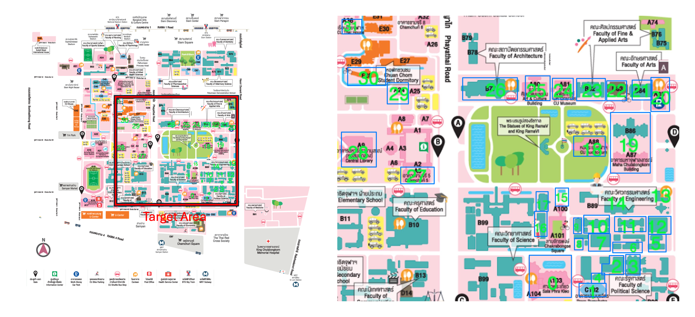
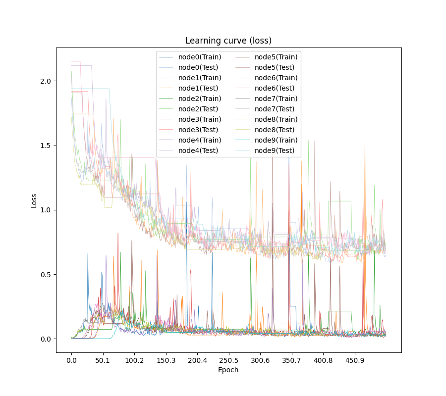
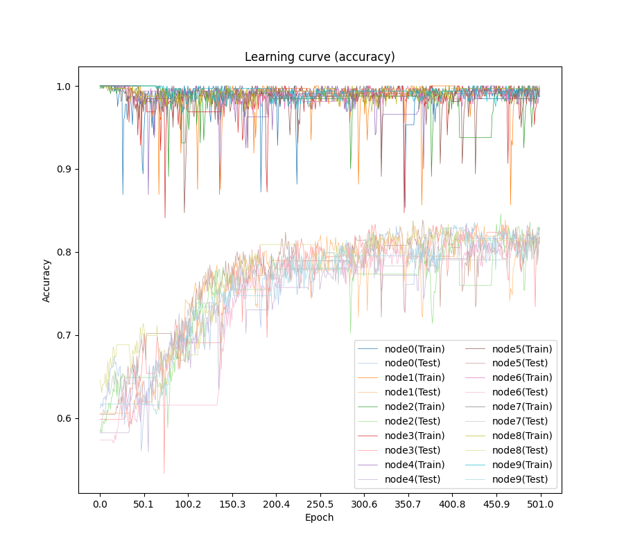
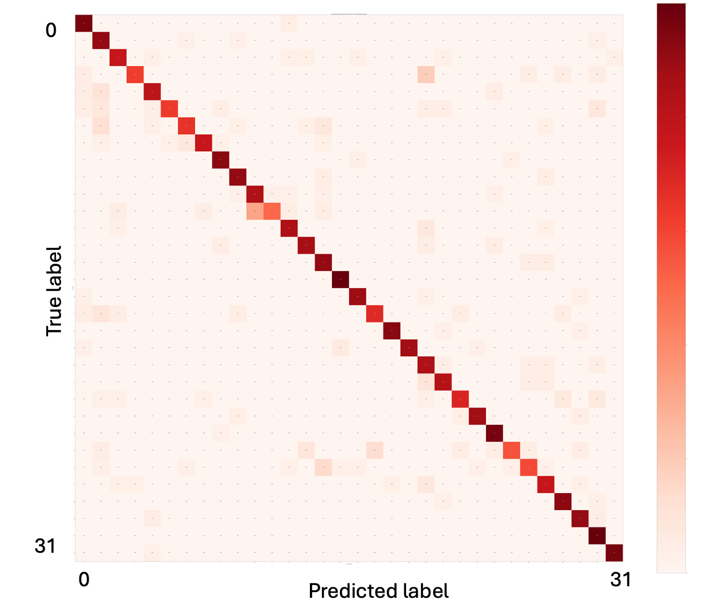

# CUBR Report

This README explains the Chulalongkorn University Building Recognition Dataset (CUBR).

## Background

In previous research on the UTBR Dataset, it was demonstrated that WAFL is effective for the UTBR Dataset, which consists of 10 labeled buildings. However, there is a lack of research examining how WAFL performs under conditions different from UTBR.

In our research, we investigate the performance of WAFL on a different dataset. To evaluate the robustness of WAFL, we constructed a new dataset, the Chulalongkorn University Buildings Recognition Dataset (CUBR), which contains 32 labeled buildings.

In our experiment, we evaluated WAFL using different models, including Resnet, VGG, Mobilenet, and ViT with 10 nodes. As a result of our experiment, we found that WAFL also works effectively with the CUBR dataset.

In conclusion, our contributions are as follows:
- Constructed a new dataset containing 32 buildings.
- Demonstrated that WAFL works under condition different from UTBR, indicating the robustness of WAFL.

## Chulalongkorn Building Recognition Dataset



We have developed the Chulalongkorn University Building Recognition Dataset (CUBR) to provide smart-campus services. The photos were captured by three individuals using their own cameras.
We selected 32 buildings as the target for these photographs, and each photo was manually labeled. The distribution of images are shown in below.

| Folder | Train Count | Val Count |
|--------|-------------|-----------|
| 0      | 98          | 25        |
| 1      | 125         | 32        |
| 2      | 101         | 26        |
| 3      | 88          | 21        |
| 4      | 83          | 20        |
| 5      | 93          | 24        |
| 6      | 103         | 26        |
| 7      | 101         | 26        |
| 8      | 104         | 26        |
| 9      | 88          | 22        |
| 10     | 120         | 31        |
| 11     | 86          | 22        |
| 12     | 104         | 26        |
| 13     | 84          | 22        |
| 14     | 86          | 22        |
| 15     | 110         | 28        |
| 16     | 103         | 26        |
| 17     | 84          | 22        |
| 18     | 120         | 30        |
| 19     | 126         | 32        |
| 20     | 99          | 25        |
| 21     | 84          | 22        |
| 22     | 107         | 27        |
| 23     | 104         | 25        |
| 24     | 120         | 30        |
| 25     | 92          | 23        |
| 26     | 113         | 29        |
| 27     | 103         | 26        |
| 28     | 102         | 26        |
| 29     | 83          | 21        |
| 30     | 86          | 22        |
| 31     | 106         | 27        |

To simulate a scenario where labels are uniformly distributed across devices, we pre-processed the photos and distributed them to ten virtual devices. This scenario is referred to as the IID-case. 

## Experimental Results

Notations of SELF-ViT and WAFL-ViT follow from previous research [1]. 
Also, parameter configurations of models and virtual areas follow from previous research [1].
For SELF-ViT, training is conducted under the condition where 32 buildings are used with 10 virtual devices.

For SELF-\*, we carried out simulations up to 1000 epochs. 
For WAFL-\*, we conducted 500 epochs of self-training and 500 epochs of collaborative training.

| Model         | Accuracy     | Standard Deviation |
|---------------|--------------|--------------------|
| WAFL-ViT      | **0.810381773**  | 0.01248877         |
| WAFL-Resnet   | 0.689482759  | 0.038941167        |
| WAFL-VGG      | 0.6358867    | 0.019503771        |
| WAFL-Mobilenet| 0.690504926  | 0.035886394        |
| SELF-ViT      | 0.603202     | 0.01723009         |
| SELF-Resnet   | 0.348892     | 0.181951853        |
| SELF-VGG      | 0.452338     | 0.016476866        |
| SELF-Mobilenet| 0.485469     | 0.036404398        |

WAFL-ViT achieved the highest accuracy of 0.810381773, indicating that it is the most robust and accurate model among the tested configurations. 

In addition, WAFL-\* achieved higher performance of its counterpart of SELF-\*.
Therefore, WAFL enhances the performance even though CUBR dataset is used.

## Trend graphs

We obtained learning curves of WAFL-ViT node 0. We observed that accuracy can be sometimes unstable.





## Confusion matrix

Also, we obtained confusion matrix of WAFL-ViT node 0.
Label 10 and 11 are mistakenly recognized according to the figure.



## Conclusion

In this study, we introduced the Chulalongkorn University Building Recognition Dataset (CUBR) to evaluate the robustness of WAFL under different conditions from the previously used UTBR dataset. 
Our experiments demonstrated that WAFL performs effectively on the CUBR dataset, achieving the highest accuracy with the WAFL-ViT model. This indicates that WAFL is robust and can generalize well to different datasets.

The experimental results showed that WAFL-\* models consistently outperformed their SELF-\* counterparts, further validating the effectiveness of WAFL. 

Overall, our research confirms that WAFL is a robust and effective approach for building recognition tasks, even when applied to new and diverse dataset CUBR.

# Code details

## Structure of this directory

```plain text
|- WAFL-ViT
|   |-data
|   |   |-val
|   |   |   |-0
|   |   |   |-1
|   |   |   
|   |   |-train
|   |   |   |-0
|   |   |   |-1
|   |   |   
|   |   |-non-IID_filter
|   |   |   |-mean.pth (Mean of images each node has)
|   |   |   |-std.pth (Standard diviation of images each node has)
|   |   |
|   |   |-contact_pattern
|   |   |   |-pattern file (Describe how to nodes contact each other)
|   |   |   
|   |   |-test_mean_and_std
|   |   |   |-mean.pth (Mean of images use for validation)
|   |   |   |-std.pth (Standard diviation of images use for validation)
|   |
|   |-src
|   |   |-functions
|   |   |   |-definitions 
|   |   |   |
|   |   |-main.py
|   |   
|   |-results
|   |   |-20240515 (Results. You can adjust its name in the program.)
|   |   |   |-log.txt
|   |   |   |-params
|   |   |   |   |-model_parameters
|   |   |   |   |-histories (Trend data in the training)
|   |   |   |-images
|   |   |   |   |-latent_space (Latent space of the model at epoch [number] for node [node_id])
|   |   |   |   |   |-ls-epoch{number}-node{node_id}.png
|   |   |   |   |-normalized_confusion_matrix (Confusion matrix of the model at epoch [number] for node [node_id])
|   |   |   |   |   |-normalized-cm-epoch{number}-node{node_id}.png
|   |   |   |   |-acc.png (Trend in accuracy)
|   |   |   |   |-loss.png (Trend in loss)
```

## Data installation

<!--


In this project, we created and utilized the dataset which consist of  images of several buildings at the University of Tokyo.
The mapping between labels and buildings is shown in the image above.
-->

You can access CUBR dataset from this [link](https://drive.google.com/drive/folders/1-QXBmc44z9ODfjvfVZ1m9sMd2AtCGw4b?usp=sharing).

Dataset v2 released.

Data installation follows [UTBR data installation](../README.md).

## Usage

### Module installation

This code has been tested and verified to work with Python 3.11.4 and CUDA 11.6.
Module installation follows [UTBR module installation](../README.md).

### How to run

To start the training and store its results, please follow these steps:

1. Ensure the dataset is correctly located in the expected directory.

    ```plain text
    |- WAFL-ViT
    |   |- data
    |   |   |-val
    |   |   |   |-0
    |   |   |   |-1
    |   |   |   
    |   |   |-train
    |   |   |   |-0
    |   |   |   |-1
    |   |   |   
    |   |   |
    ```

2. Check that all required dependencies are correctly installed.
3. Move to the `src` directory:
  
    ```Linux
    cd src
    ```

4. Prepare contact patterns and filters:

    ```Linux
    python utils/generate_contact_pattern.py
    ```

5. Review and adjust the experimental settings in the config file(`src/config.json`). For detailed instructions on how to write and configure the setting file, please refer to the [Configuration File Guide](#configuration-file-guide):

    ```Linux
    vim config.json  # or use any text editor of your choice
    ```

6. Start the training process:

    ```Linux
    python main_v2.py --config configs/{config_name}.json
    ```

    For example, 

    ```Linux
    python main_v2.py --config configs/config_32_vit.json
    ```


7. Verify the start of the training process:

   After starting the training process, you can find that log in `results/{result folder name}/log.txt`.

8. Confirm the log file(`results/{result folder name}/log.txt`):

   You can find your experimental conditions in the log file.

## Output

Output follows from [UTBR output](../README.md). However, the section of "Trend graph" is changed slightly as shown in below.

### Trend graph

To show learning curve, run the code below.
```plain text
python utils/visualizer.py ../results/{result folder name}/params/histories_d
ata.pkl
```
Then, trend graphs for all nodes are created in `results/{result folder name}/images/acc.png (or loss.png)`.

## Configuration File Guide

Configuration file follows from Data installation follows [UTBR config](../README.md). However, the section of "data" is changed slightly as shown in below.

### data

`n_node`(int): The number of nodes that participate in the training process of WAFL.

`num_classes`(int): The number of classes that participate in the training process of WAFL.

## References

\[1\] Hideya Ochiai, Atsuya Muramatsu, Yudai Ueda, Ryuhei Yamaguchi, Kazuhiro Katoh, and Hiroshi Esaki, "[Tuning Vision Transformer with Device-to-Device Communication for Targeted Image Recognition](https://ieeexplore.ieee.org/abstract/document/10539480)", IEEE World Forum on Internet of Things, 2023. 
