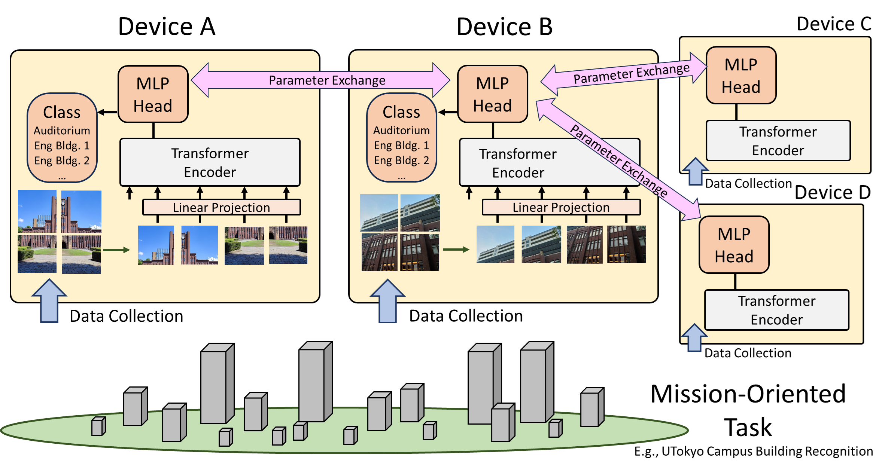

# WAFL-ViT

Wireless Ad Hoc Federated Learning with Vision Transformer (WAFL-ViT). This project provides the code for the paper "Tuning Vision Transformer with Device-to-Device Communication for Targeted Image Recognition" \[1\] awarded the best paper (2nd place) at IEEE World Forum on the Internet of Things 2023.

## Architecture



The figure shows the overview of WAFL-Vision Transformer. It is composed of multiple devices. Each of them collects data from the target environment and fine-tunes the pre-trained Vision Transformer (ViT). Here, the MLP head of ViT is replaced with another feedforward layer to fit the target task.

In our scenario, each device has ad hoc wireless interfaces and exchanges the MLP head with the neighbors through device-to-device communications (although the project code is for simulation only). This communication can be a combination of Bluetooth and Wi-Fi: i.e., finding friend workers by Bluetooth and exchanging model parameters by Wi-Fi ad hoc mode. The exchanged MLP heads are aggregated by the WAFL algorithm as below.


Here, $n$ and $k$ are the devices that participated in the training. $nbr(n)$ is the set of neighbor nodes of device $n$. $W^n$ indicates the parameters of MLP head of device $n$. $\lambda$ is the coefficient which should be between 0 and 1.

## Data Set


As a mission-oriented task, we have generated UTokyo Building Recognition Dataset (UTBR) to provide a smart-campus service. The photos were captured by five persons with their own smartphone cameras individually. We have chosen ten buildings as the photo target, and each of the photos is labeled manually. 


This figure shows the examples -- target buildings were taken from the front, back, and sides, sometimes closely, looking up, or from afar, or with a telescopic mode. Some photos contain trees, clouds, and the sun. This characteristic is not available in MNIST or CIFAR-10 datasets.

We then pre-processed the photos to distribute to virtual ten devices for both IID and Non-IID scenarios described in the previous section. The following table below shows the distributions. In the IID scenario, all the nodes have relatively the same label distributions, whereas, in the Non-IID scenario, the label distributions are dependent on the device. For example, device 0 has a larger amount of label 0 photos. Please note that even if the label distribution is IID, the devices' local photos do not cover all the scenes equally with other devices because the number of stored photos for one building is around 10 to 20.

| Device | L1 | L2 | L3 | L4 | L5 | L6 | L7 | L8 | L9 | SUM |
| ---- | ---- |  ---- |  ---- |  ---- |  ---- |  ---- |  ---- |  ---- |  ---- |  ---- | 
| 0 | 11 | 16 | 10 | 10 | 12 | 13 | 12 | 17 | 14 | 20 | 135 |
| 0 | 11 | 16 | 10 | 10 | 12 | 13 | 12 | 17 | 14 | 20 | 135 |

## Concept of this folder

- In this project, we aimed to train models that is larger and can solve more complicated tasks than that of the project in WAFL-MLP folder.

- We combined transfer learning and WAFL to allow real-domain complex images to input the model with reasonable computational cost and network load.

- We compared multiple models and clarified VisionTransformer experimentally showed the best result.

## Structure of this directory

```plain text
|- WAFL-ViT
|   |- data
|   |   |-val
|   |   |   |-0
|   |   |   |-1
|   |   |   
|   |   |-train
|   |   |   |-0
|   |   |   |-1
|   |   |   
|   |   |-non-IID_filter
|   |   |   |-mean.pth (Mean of images each node has)
|   |   |   |-std.pth (Standard diviation of images each node has)
|   |   |
|   |   |-contact_pattern
|   |   |   |-pattern file (Describe how to nodes contact each other)
|   |   |   
|   |   |-test_mean_and_std
|   |   |   |-mean.pth (Mean of images use for validation)
|   |   |   |-std.pth (Standard diviation of images use for validation)
|   |
|   |-src
|   |   |-functions
|   |   |   |-definitions 
|   |   |   |
|   |   |-main.py
|   |   
|   |-results
|   |   |-20240515 (Results. You can adjust its name in the program.)
|   |   |   |-log
|   |   |   |-model_parameter
|   |   |   |-histories
```

## Data installation


In this project, we created and utilized the dataset which consist of  images of several buildings at the University of Tokyo.
The mapping between labels and buildings is shown in the image above.

You can access our dataset from [this link](https://drive.google.com/file/d/1GKbMyfAkvCVT1a6g2KyvkC3MYxf5VPrZ/view).

After downloading zip file, please extract its contents into the `WAFL-ViT/data` directory of the project root.
If you're using the command line and are in the project root (`wafl` directory), you can use the following command to extract the files:

``` Linux
cd WAFL-ViT
mv [downloaded file path] ./
unzip -q vit_data.zip
mv vit_data/* data/
rm -r vit_data*
```

Regarding usage or licensing of this dataset, please refer to the `LICENSE` in the project root.

## Usage

### Module installation

This code has been tested and verified to work with Python 3.11.4 and CUDA 11.4.
The specific versions of key dependencies used in our test environment are listed in the `requirements.txt` file.

However, please note that you may need to adjust the versions, especially for `torch` and `torchvision`, to match your specific environment and CUDA version.

After ensuring versions of required dependencies, install them by following commands:

```Linux
pip install -r requirements.txt
```

If you encounter any issues, you may need to modify the versions in `requirements.txt` to suit your specific setup. In particular, ensure that the `torch` and `torchvision` versions are compatible with your CUDA installation if you're using GPU acceleration.

### How to run

To start the training and store its results, please follow these steps:

1. Ensure the dataset is correctly located in the expected directory.

    ```plain text
    |- WAFL-ViT
    |   |- data
    |   |   |-val
    |   |   |   |-0
    |   |   |   |-1
    |   |   |   
    |   |   |-train
    |   |   |   |-0
    |   |   |   |-1
    |   |   |   
    |   |   |-non-IID_filter
    |   |   |
    ```

2. Check that all required dependencies are correctly installed.
3. Move to the `src` directory:
  
    ```Linux
    cd src
    ```

4. Prepare contact patterns and filters:

    ```Linux
    python utils/generate_contact_pattern.py
    python utils/generate_nonIID_filter.py
    ```

5. Review and adjust the experimental settings in the config file(`src/config.json`):

    ```Linux
    vim config.json  # or use any text editor of your choice
    ```

6. Start the training process:

    ```Linux
    python main.py
    ```
